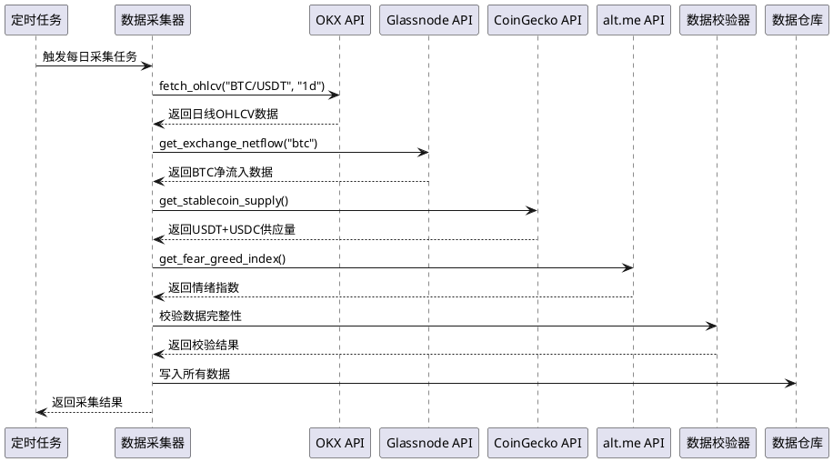
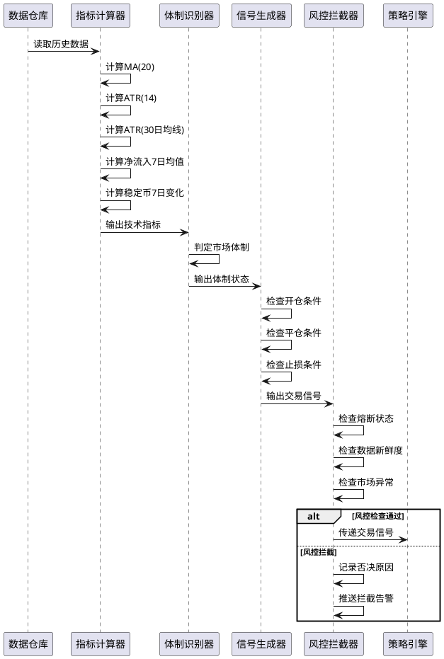
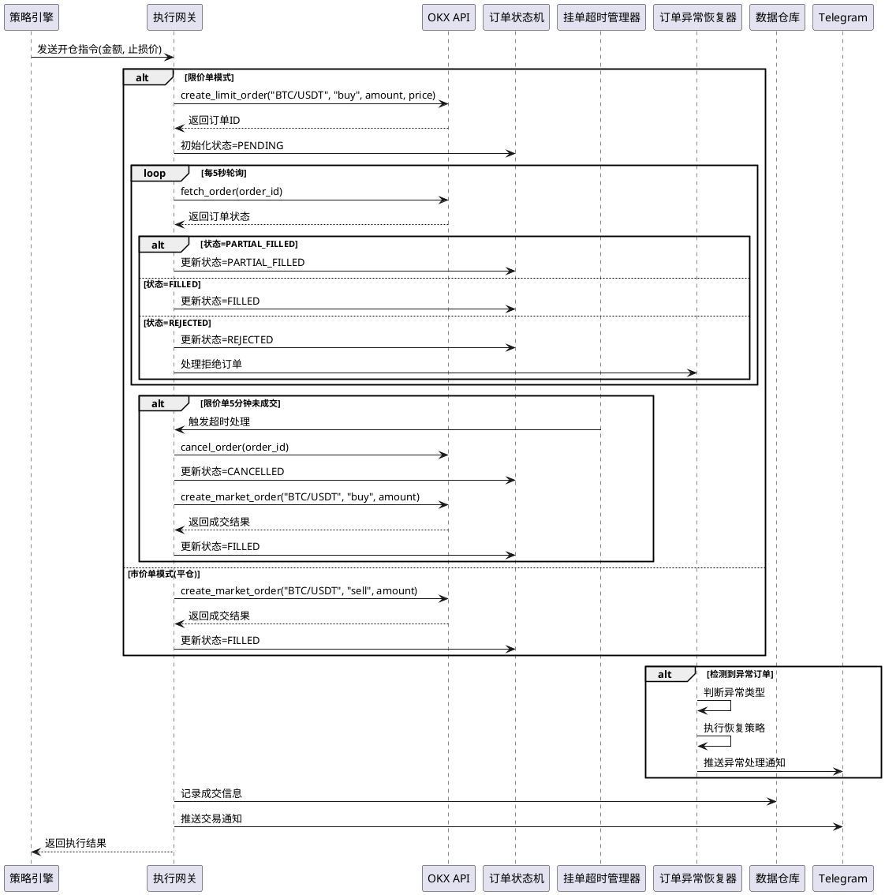
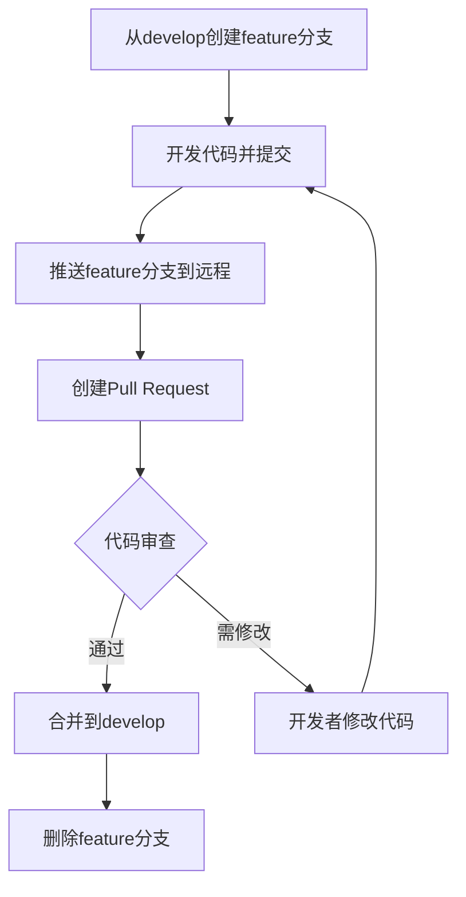

# AOSFT-MVP 技术架构设计文档

**版本**: v1.0  
**项目名称**: AOSFT-MVP — 链上与体制感知的BTC趋势跟踪系统  
**生成日期**: 2026-05-18

---

# 1. 实现模型

## 1.1 上下文视图

系统与外部系统的交互上下文如下:

```plantuml
@startuml
skinparam componentStyle rectangle

rectangle "AOSFT-MVP系统" {
    rectangle "数据采集层" as data_layer
    rectangle "策略计算层" as strategy_layer
    rectangle "执行层" as execution_layer
    rectangle "风控层" as risk_layer
}

actor "交易系统管理员" as admin
actor "投资决策者" as investor

admin --> AOSFT-MVP系统 : 配置参数/启动停止/异常处理
investor --> AOSFT-MVP系统 : 查看报告/决策审批

rectangle "OKX API" as okx
rectangle "Glassnode/CryptoQuant" as glassnode
rectangle "CoinGecko API" as coingecko
rectangle "alternative.me API" as altme
rectangle "Telegram Bot" as telegram
rectangle "监控面板" as monitor

data_layer --> okx : 行情数据查询
execution_layer --> okx : 交易执行/订单查询
data_layer --> glassnode : 链上数据查询
data_layer --> coingecko : 稳定币数据查询
data_layer --> altme : 情绪指数查询
execution_layer --> telegram : 推送通知/告警
AOSFT-MVP系统 --> monitor : 输出监控数据

@enduml
```

## 1.2 服务/组件总体架构

系统采用分层架构设计,分为五层:

### 1.2.1 架构分层

```
┌─────────────────────────────────────────────────────────┐
│                    定时调度层(Scheduler)                  │
│              Cron定时任务触发、任务编排                      │
└─────────────────────────────────────────────────────────┘
                             ↓
┌─────────────────────────────────────────────────────────┐
│                  数据采集层(Data Collector)               │
│      OKX行情、链上数据、稳定币数据、情绪指数采集            │
│      数据时间戳管理、数据质量评分                          │
└─────────────────────────────────────────────────────────┘
                             ↓
┌─────────────────────────────────────────────────────────┐
│                    风控前置拦截层(Risk Interceptor)        │
│     熔断状态检查、数据新鲜度检查、市场异常检查              │
│              一票否决权、信号拦截                          │
└─────────────────────────────────────────────────────────┘
                             ↓
┌─────────────────────────────────────────────────────────┐
│                  策略计算层(Strategy Engine)             │
│      指标计算、体制定义、信号生成、仓位决策                 │
└─────────────────────────────────────────────────────────┘
                             ↓
┌─────────────────────────────────────────────────────────┐
│                    执行层(Execution)                      │
│    订单状态机、挂单超时管理、订单异常恢复                    │
│          OKX执行网关、结果确认                             │
└─────────────────────────────────────────────────────────┘
                             ↓
┌─────────────────────────────────────────────────────────┐
│                    风控层(Risk Control)                   │
│      硬止损、分级熔断恢复、闪崩保护、监控告警               │
└─────────────────────────────────────────────────────────┘
```

### 1.2.2 核心模块划分

#### 数据采集模块 (Data Collector)
- **职责**: 从多个外部数据源采集并存储数据，管理数据时间戳和质量评分
- **子模块**:
  - OKX行情采集器: 获取BTC/USDT日线OHLCV数据
  - 链上数据采集器: 获取交易所BTC净流入数据
  - 稳定币数据采集器: 获取USDT+USDC供应量数据
  - 情绪指数采集器: 获取Fear & Greed Index
  - 数据校验器: 验证数据完整性和有效性
  - 数据时间戳管理器: 标记数据采集时间和数据日期，计算数据新鲜度
  - 数据质量评分器: 根据数据延迟计算质量评分，过期数据降权使用

#### 风控前置拦截模块 (Risk Interceptor)
- **职责**: 在信号传递到执行层前进行风控检查，拥有一票否决权
- **子模块**:
  - 熔断状态检查器: 检查当前是否处于熔断暂停期
  - 数据新鲜度检查器: 检查依赖数据是否过期
  - 市场异常检查器: 检查市场是否出现异常波动
  - 拦截决策器: 综合各项检查结果，决定是否拦截信号
  - 否决原因记录器: 记录拦截原因，供审计和监控使用

#### 指标计算模块 (Indicator Calculator)
- **职责**: 计算技术指标和衍生指标
- **子模块**:
  - MA计算器: 计算移动平均线
  - ATR计算器: 计算平均真实波动幅度
  - 净流入趋势计算器: 计算净流入7日均值
  - 稳定币变化计算器: 计算供应量变化

#### 体制识别模块 (Regime Detector)
- **职责**: 根据技术指标识别市场体制
- **子模块**:
  - 趋势判断器: 判断上涨/下跌趋势
  - 波动率判断器: 判断高/低波动环境
  - 体制定义器: 输出BULL_VOLATILE/BEAR_VOLATILE/LOW_VOLATILE

#### 信号生成模块 (Signal Generator)
- **职责**: 综合所有条件生成交易信号
- **子模块**:
  - 开仓信号生成器: 检查开仓条件
  - 平仓信号生成器: 检查平仓条件
  - 止损信号生成器: 检查硬止损触发

#### 策略决策引擎 (Strategy Engine)
- **职责**: 管理仓位和执行决策逻辑
- **子模块**:
  - 仓位管理器: 计算开仓金额和止损价格
  - 频率控制器: 控制交易频率
  - 合约模式处理器: 处理永续合约特殊逻辑

#### 风险控制模块 (Risk Control)
- **职责**: 实时监控并执行风控措施，管理分级熔断恢复
- **子模块**:
  - 硬止损执行器: 每4小时检查止损触发
  - 闪崩保护器: 监控短期大幅下跌
  - 熔断管理器: 管理全局回撤熔断、黑天鹅熔断和分级恢复
  - 分级恢复管理器: 管理熔断后的分级仓位恢复（10天50%，20天100%）
  - 人工恢复处理器: 处理管理员提前恢复请求
  - 风控决策器: 确定风控优先级

#### 执行网关 (Execution Gateway)
- **职责**: 与OKX交易所交互执行订单，管理订单状态机和异常恢复
- **子模块**:
  - OKX订单管理器: 提交/撤销/查询订单
  - 限价单处理器: 处理限价单逻辑
  - 市价单处理器: 处理市价单逻辑
  - 订单状态轮询器: 轮询订单成交状态
  - 订单状态机: 管理订单状态转换（PENDING→PARTIAL_FILLED→FILLED/REJECTED/CANCELLED）
  - 挂单超时管理器: 监控挂单超时，触发撤单或改单
  - 订单异常恢复器: 处理异常订单（部分成交超时、挂单无响应等）

#### 监控告警模块 (Monitor & Alert)
- **职责**: 输出监控数据和推送告警，统计各类监控指标
- **子模块**:
  - Telegram推送器: 推送交易通知和告警
  - 监控数据输出器: 输出到监控面板
  - 日志记录器: 记录系统运行日志
  - 数据新鲜度监控器: 监控各数据源最后更新时间
  - 策略性能监控器: 统计信号胜率、盈亏比、连续亏损次数
  - 风控触发统计器: 统计各类熔断触发次数和原因
  - API调用统计器: 统计API调用成功率和延迟分布

#### 回测系统 (Backtesting)
- **职责**: 在历史数据上验证策略表现，支持多种验证模式
- **子模块**:
  - 历史数据加载器: 加载历史数据
  - 回测模拟器: 模拟交易执行
  - 指标计算器: 计算回测评估指标
  - 模拟盘验证器: 在OKX Testnet环境验证策略
  - 极端行情回测器: 测试黑天鹅场景表现
  - 参数敏感性分析器: 评估参数变化对策略影响
  - 并发压力测试器: 验证定时任务并发处理能力

## 1.3 实现设计文档

### 1.3.1 技术栈选型

#### 编程语言与运行时
- **语言**: Python 3.10+
- **理由**: 
  - 丰富的数据科学生态(Pandas, NumPy)
  - 成熟的交易所SDK(CCXT库)
  - 易于编写和维护的交易逻辑

#### 核心依赖库
1. **CCXT (v4.0+)**: 统一的加密货币交易所API接口
   - 支持OKX现货和永续合约API
   - 统一的订单管理接口
   - 内置签名和认证机制

2. **Pandas (v2.0+)**: 数据处理和分析
   - 时间序列数据处理
   - 技术指标计算
   - 数据对齐和重采样

3. **NumPy (v1.24+)**: 数值计算
   - 高性能数组运算
   - 数学函数库

4. **APScheduler (v3.10+)**: 定时任务调度
   - Cron风格定时任务
   - 任务持久化
   - 错过执行处理

5. **Requests (v2.31+)**: HTTP请求
   - 调用Glassnode/CoinGecko等数据API
   - 连接池和重试机制

6. **SQLite3**: 轻量级数据库
   - 存储历史行情数据
   - 存储交易记录
   - 无需独立数据库服务

7. **python-telegram-bot (v20+)**: Telegram Bot集成
   - 推送交易通知
   - 推送告警消息

#### 可选依赖
- **TA-Lib**: 技术指标库(用于加速计算)
- **Plotly/Dash**: 可视化监控面板
- **Grafana + InfluxDB**: 生产级监控方案

### 1.3.2 数据流设计

#### 数据采集流程



#### 信号计算流程



#### 交易执行流程



---

# 2. 接口设计

## 2.1 总体设计

### 2.1.1 内部模块接口设计原则
- 使用Python类和方法进行模块间调用
- 模块间通过数据对象(Pandas DataFrame/自定义数据类)传递数据
- 采用依赖注入方式管理模块依赖
- 使用类型注解(Type Hints)确保类型安全

### 2.1.2 外部API接口设计原则
- OKX API: 通过CCXT库统一封装,支持现货和永续合约
- 链上数据API: 使用Requests库调用REST接口
- Telegram API: 使用python-telegram-bot库封装
- 所有外部API调用均需实现重试和超时机制

## 2.2 接口清单

### 2.2.1 OKX交易所接口(通过CCXT库)

#### 行情数据查询接口

```python
class OKXMarketInterface:
    """OKX行情数据查询接口"""
    
    def __init__(self, api_key: str, secret: str, password: str):
        """
        初始化OKX客户端
        
        Args:
            api_key: OKX API密钥
            secret: OKX API密钥密文
            password: OKX API密码
        """
        pass
    
    def fetch_ohlcv(
        self,
        symbol: str = "BTC/USDT",
        timeframe: str = "1d",
        since: Optional[int] = None,
        limit: int = 500
    ) -> pd.DataFrame:
        """
        获取K线数据
        
        Args:
            symbol: 交易对符号
            timeframe: 时间周期("1d"表示日线)
            since: 起始时间戳(毫秒)
            limit: 返回数据条数
            
        Returns:
            DataFrame with columns: [timestamp, open, high, low, close, volume]
            
        Raises:
            APIConnectionError: OKX API连接失败
            APIResponseError: OKX返回异常数据
        """
        pass
    
    def fetch_ticker(self, symbol: str = "BTC/USDT") -> Dict:
        """
        获取最新价格信息
        
        Args:
            symbol: 交易对符号
            
        Returns:
            {
                'symbol': 'BTC/USDT',
                'last': 45000.0,  # 最新价格
                'bid': 44995.0,   # 买一价
                'ask': 45005.0,   # 卖一价
                'timestamp': 1234567890000
            }
        """
        pass
```

#### 交易执行接口

```python
class OKXTradingInterface:
    """OKX交易执行接口"""
    
    def __init__(
        self,
        api_key: str,
        secret: str,
        password: str,
        account_type: str = "spot"  # "spot"或"swap"
    ):
        """
        初始化交易接口
        
        Args:
            account_type: 账户类型
                - "spot": 现货账户
                - "swap": 永续合约账户
        """
        pass
    
    def create_limit_order(
        self,
        symbol: str,
        side: str,  # "buy" or "sell"
        amount: float,
        price: float
    ) -> Dict:
        """
        创建限价单
        
        Args:
            symbol: 交易对("BTC/USDT")
            side: 买卖方向
            amount: 数量(BTC)
            price: 价格(USDT)
            
        Returns:
            {
                'id': 'order_id_123',
                'symbol': 'BTC/USDT',
                'type': 'limit',
                'side': 'buy',
                'price': 45000.0,
                'amount': 0.1,
                'status': 'open',
                'timestamp': 1234567890000
            }
            
        Raises:
            InsufficientFundsError: 余额不足
            OrderRejectedError: 订单被OKX拒绝
        """
        pass
    
    def create_market_order(
        self,
        symbol: str,
        side: str,
        amount: float,
        slippage: float = 0.002  # 滑点容忍0.2%
    ) -> Dict:
        """
        创建市价单
        
        Args:
            slippage: 滑点容忍度,默认0.2%
            
        Returns:
            订单信息字典
        """
        pass
    
    def cancel_order(self, order_id: str, symbol: str) -> bool:
        """
        撤销订单
        
        Args:
            order_id: 订单ID
            symbol: 交易对
            
        Returns:
            是否撤销成功
        """
        pass
    
    def fetch_order(self, order_id: str, symbol: str) -> Dict:
        """
        查询订单状态
        
        Returns:
            {
                'id': 'order_id_123',
                'status': 'closed',  # 'open', 'closed', 'canceled'
                'filled': 0.1,       # 已成交数量
                'remaining': 0.0,    # 剩余数量
                'average': 45001.5,  # 平均成交价
                'fee': 45.0          # 手续费
            }
        """
        pass
    
    def fetch_balance(self) -> Dict:
        """
        查询账户余额
        
        Returns:
            {
                'USDT': {'free': 10000.0, 'used': 5000.0, 'total': 15000.0},
                'BTC': {'free': 0.5, 'used': 0.0, 'total': 0.5}
            }
        """
        pass
    
    def fetch_positions(self) -> List[Dict]:
        """
        查询持仓信息(仅永续合约)
        
        Returns:
            [{
                'symbol': 'BTC/USDT:USDT',
                'side': 'long',
                'contracts': 0.1,
                'entryPrice': 45000.0,
                'unrealizedPnl': 50.0
            }]
        """
        pass
    
    def fetch_funding_rate(self, symbol: str = "BTC/USDT:USDT") -> float:
        """
        查询资金费率(仅永续合约)
        
        Returns:
            资金费率,如0.0001表示0.01%
        """
        pass
```

#### OKX API配置与认证

```python
# OKX API配置示例
OKX_CONFIG = {
    'apiKey': 'your-api-key',
    'secret': 'your-secret-key',
    'password': 'your-api-password',  # OKX特有的API密码
    'enableRateLimit': True,  # 启用限流
    'options': {
        'defaultType': 'spot',  # 默认现货
    }
}

# 永续合约配置
OKX_SWAP_CONFIG = {
    'apiKey': 'your-api-key',
    'secret': 'your-secret-key',
    'password': 'your-api-password',
    'options': {
        'defaultType': 'swap',  # 永续合约
    }
}
```

### 2.2.2 链上数据接口

```python
class GlassnodeInterface:
    """Glassnode链上数据接口"""
    
    def __init__(self, api_key: str):
        pass
    
    def get_exchange_netflow(
        self,
        asset: str = "btc",
        since: Optional[int] = None,
        until: Optional[int] = None
    ) -> pd.DataFrame:
        """
        获取交易所净流入数据
        
        Returns:
            DataFrame with columns: [timestamp, netflow]
        """
        pass


class CryptoQuantInterface:
    """CryptoQuant链上数据接口"""
    
    def __init__(self, api_key: str):
        pass
    
    def get_exchange_netflow(
        self,
        asset: str = "btc"
    ) -> pd.DataFrame:
        """
        获取交易所净流入数据
        
        Returns:
            DataFrame with columns: [timestamp, netflow]
        """
        pass
```

### 2.2.3 稳定币数据接口

```python
class CoinGeckoInterface:
    """CoinGecko稳定币数据接口"""
    
    def get_stablecoin_supply(self) -> Dict:
        """
        获取稳定币供应量
        
        Returns:
            {
                'usdt_supply': 80000000000.0,
                'usdc_supply': 40000000000.0,
                'total_supply': 120000000000.0,
                'timestamp': 1234567890
            }
        """
        pass
```

### 2.2.4 情绪指数接口

```python
class FearGreedIndexInterface:
    """Fear & Greed Index接口"""
    
    def get_index(self) -> Dict:
        """
        获取恐惧贪婪指数
        
        Returns:
            {
                'value': 45,
                'classification': 'Fear',
                'timestamp': 1234567890
            }
        """
        pass
```

### 2.2.5 Telegram通知接口

```python
class TelegramInterface:
    """Telegram Bot通知接口"""
    
    def __init__(self, bot_token: str, chat_id: str):
        pass
    
    def send_trade_notification(
        self,
        trade_type: str,  # "OPEN" or "CLOSE"
        symbol: str,
        amount: float,
        price: float,
        pnl: Optional[float] = None
    ) -> bool:
        """
        发送交易通知
        
        Returns:
            是否发送成功
        """
        pass
    
    def send_alert(
        self,
        alert_type: str,  # "DATA_ERROR", "RISK_ALERT", etc.
        message: str
    ) -> bool:
        """
        发送告警消息
        """
        pass
```

### 2.2.6 订单状态机接口

```python
from enum import Enum

class OrderStatus(str, Enum):
    """订单状态枚举"""
    PENDING = "PENDING"                    # 已提交，待成交
    PARTIAL_FILLED = "PARTIAL_FILLED"      # 部分成交
    FILLED = "FILLED"                      # 全部成交
    REJECTED = "REJECTED"                  # 被交易所拒绝
    CANCELLED = "CANCELLED"                # 已撤销

class OrderStateMachine:
    """订单状态机"""
    
    def __init__(self):
        self.current_state = OrderStatus.PENDING
    
    def transition(self, event: str, context: Dict) -> OrderStatus:
        """
        状态转换
        
        Args:
            event: 触发事件
                - "PARTIAL_FILL": 部分成交
                - "FULL_FILL": 全部成交
                - "REJECT": 被拒绝
                - "CANCEL": 被撤销
            context: 上下文信息
            
        Returns:
            新的订单状态
            
        Raises:
            InvalidTransitionError: 非法状态转换
        """
        pass
    
    def is_final_state(self) -> bool:
        """
        判断是否达到最终状态
        
        Returns:
            是否为最终状态(FILLED/REJECTED/CANCELLED)
        """
        pass

class OrderTimeoutManager:
    """挂单超时管理器"""
    
    def __init__(
        self,
        limit_order_timeout: int = 300,  # 限价单超时时间(秒)
        max_timeout: int = 1800          # 最大超时时间(秒)
    ):
        pass
    
    def start_timer(self, order_id: str, order_type: str):
        """
        启动超时计时器
        
        Args:
            order_id: 订单ID
            order_type: 订单类型("LIMIT"或"MARKET")
        """
        pass
    
    def check_timeout(self, order_id: str) -> bool:
        """
        检查订单是否超时
        
        Returns:
            是否超时
        """
        pass
    
    def get_timeout_action(self, order_id: str) -> str:
        """
        获取超时处理动作
        
        Returns:
            处理动作:
                - "CANCEL_AND_MARKET": 撤单并改市价单
                - "FORCE_CANCEL": 强制撤单
                - "CONTINUE_WAIT": 继续等待
        """
        pass

class OrderRecoveryHandler:
    """订单异常恢复处理器"""
    
    def detect_anomaly(self, order: Dict) -> Optional[str]:
        """
        检测订单异常
        
        Args:
            order: 订单信息
            
        Returns:
            异常类型:
                - "PARTIAL_FILL_TIMEOUT": 部分成交超时
                - "PENDING_TIMEOUT": 挂单超时无响应
                - "REJECTED": 订单被拒绝
                - None: 无异常
        """
        pass
    
    def execute_recovery(
        self,
        order_id: str,
        anomaly_type: str,
        context: Dict
    ) -> Dict:
        """
        执行恢复策略
        
        Args:
            order_id: 订单ID
            anomaly_type: 异常类型
            context: 上下文信息
            
        Returns:
            恢复结果
        """
        pass
```

### 2.2.7 风控前置拦截器接口

```python
class RiskInterceptor:
    """风控前置拦截器"""
    
    def __init__(
        self,
        risk_control: 'RiskControl',
        db: 'DataRepository'
    ):
        self.risk_control = risk_control
        self.db = db
    
    def intercept(self, signal: 'TradeSignal') -> Tuple[bool, Optional[str]]:
        """
        拦截检查
        
        Args:
            signal: 交易信号
            
        Returns:
            (是否通过, 拦截原因)
            - (True, None): 通过检查
            - (False, reason): 被拦截，返回拦截原因
        """
        pass
    
    def check_circuit_breaker_status(self) -> bool:
        """
        检查熔断状态
        
        Returns:
            True: 正常状态
            False: 处于熔断暂停期
        """
        pass
    
    def check_data_freshness(self) -> Tuple[bool, Optional[str]]:
        """
        检查数据新鲜度
        
        Returns:
            (是否新鲜, 过期数据源列表)
        """
        pass
    
    def check_market_anomaly(self) -> bool:
        """
        检查市场异常
        
        Returns:
            True: 市场正常
            False: 市场异常
        """
        pass
    
    def record_veto_reason(
        self,
        signal_id: str,
        reason: str,
        timestamp: int
    ):
        """
        记录否决原因
        
        Args:
            signal_id: 信号ID
            reason: 否决原因
            timestamp: 时间戳
        """
        pass
```

### 2.2.8 数据仓库接口

```python
class DataRepository:
    """数据仓库接口(SQLite)"""
    
    def save_ohlcv(self, df: pd.DataFrame) -> bool:
        """保存日线行情数据"""
        pass
    
    def load_ohlcv(
        self,
        symbol: str = "BTC/USDT",
        since: Optional[str] = None,
        until: Optional[str] = None
    ) -> pd.DataFrame:
        """加载历史行情数据"""
        pass
    
    def save_netflow(self, df: pd.DataFrame) -> bool:
        """保存链上净流入数据"""
        pass
    
    def load_netflow(self, days: int = 30) -> pd.DataFrame:
        """加载链上数据"""
        pass
    
    def save_signal(self, signal: Signal) -> bool:
        """保存交易信号记录"""
        pass
    
    def save_position(self, position: Position) -> bool:
        """保存持仓记录"""
        pass
    
    def load_current_position(self) -> Optional[Position]:
        """加载当前持仓"""
        pass

class DataTimestampManager:
    """数据时间戳管理器"""
    
    def mark_collection_time(
        self,
        data_type: str,  # "ohlcv", "netflow", "stablecoin", "sentiment"
        date: str,
        collection_time: int
    ) -> bool:
        """
        标记数据采集时间
        
        Args:
            data_type: 数据类型
            date: 数据日期(YYYY-MM-DD)
            collection_time: 采集时间戳(毫秒)
            
        Returns:
            是否标记成功
        """
        pass
    
    def calculate_freshness(
        self,
        data_type: str,
        date: str
    ) -> int:
        """
        计算数据新鲜度
        
        Args:
            data_type: 数据类型
            date: 数据日期
            
        Returns:
            延迟天数(距当前时间)
        """
        pass
    
    def get_last_update_time(self, data_type: str) -> Optional[int]:
        """
        获取数据源最后更新时间
        
        Args:
            data_type: 数据类型
            
        Returns:
            最后更新时间戳(毫秒)
        """
        pass

class DataQualityScorer:
    """数据质量评分器"""
    
    def __init__(
        self,
        full_score_threshold: int = 1,    # 满分阈值(天)
        downgrade_threshold: int = 2,     # 降权阈值(天)
        stale_threshold: int = 3          # 过期阈值(天)
    ):
        pass
    
    def calculate_score(self, delay_days: int) -> float:
        """
        计算数据质量评分
        
        Args:
            delay_days: 数据延迟天数
            
        Returns:
            质量评分(0-1):
                - 延迟≤1天: 1.0
                - 延迟=2天: 0.8
                - 延迟≥3天: 0.5
        """
        pass
    
    def mark_quality_score(
        self,
        data_type: str,
        date: str,
        score: float
    ) -> bool:
        """
        标记数据质量评分
        
        Args:
            data_type: 数据类型
            date: 数据日期
            score: 质量评分
            
        Returns:
            是否标记成功
        """
        pass
```

---

# 3. 数据模型

## 3.1 设计目标

- 使用SQLite轻量级数据库存储历史数据
- 采用规范化设计,避免数据冗余
- 为常用查询字段建立索引,提升查询性能
- 使用类型注解和Pydantic进行数据验证

## 3.2 模型实现

### 3.2.1 数据库表结构设计

#### 日线行情表 (daily_ohlcv)

```sql
CREATE TABLE daily_ohlcv (
    id INTEGER PRIMARY KEY AUTOINCREMENT,
    symbol TEXT NOT NULL,              -- 交易对,如"BTC/USDT"
    timestamp INTEGER NOT NULL,        -- 时间戳(毫秒)
    date TEXT NOT NULL,                -- 日期字符串"YYYY-MM-DD"
    open REAL NOT NULL,                -- 开盘价
    high REAL NOT NULL,                -- 最高价
    low REAL NOT NULL,                 -- 最低价
    close REAL NOT NULL,               -- 收盘价
    volume REAL NOT NULL,              -- 交易量
    created_at INTEGER NOT NULL,       -- 记录创建时间
    
    UNIQUE(symbol, timestamp),         -- 唯一约束
    CHECK(high >= open AND high >= close),
    CHECK(low <= open AND low <= close),
    CHECK(open > 0 AND high > 0 AND low > 0 AND close > 0)
);

CREATE INDEX idx_ohlcv_symbol_date ON daily_ohlcv(symbol, date);
CREATE INDEX idx_ohlcv_timestamp ON daily_ohlcv(timestamp);
```

#### 链上净流入表 (onchain_netflow)

```sql
CREATE TABLE onchain_netflow (
    id INTEGER PRIMARY KEY AUTOINCREMENT,
    date TEXT NOT NULL,                -- 日期"YYYY-MM-DD"
    netflow REAL NOT NULL,             -- 净流入量(BTC)
    source TEXT NOT NULL,              -- 数据来源"Glassnode"或"CryptoQuant"
    delay_days INTEGER NOT NULL,       -- 数据延迟天数
    collection_timestamp INTEGER NOT NULL, -- 实际采集时间戳(毫秒)
    freshness INTEGER NOT NULL,        -- 数据新鲜度(距当前延迟天数)
    quality_score REAL NOT NULL,       -- 数据质量评分(0-1)
    created_at INTEGER NOT NULL,
    
    UNIQUE(date, source),
    CHECK(delay_days >= 0),
    CHECK(quality_score >= 0 AND quality_score <= 1)
);

CREATE INDEX idx_netflow_date ON onchain_netflow(date);
CREATE INDEX idx_netflow_freshness ON onchain_netflow(freshness);
```

#### 稳定币供应表 (stablecoin_supply)

```sql
CREATE TABLE stablecoin_supply (
    id INTEGER PRIMARY KEY AUTOINCREMENT,
    date TEXT NOT NULL UNIQUE,         -- 日期"YYYY-MM-DD"
    usdt_supply REAL NOT NULL,         -- USDT供应量
    usdc_supply REAL NOT NULL,         -- USDC供应量
    total_supply REAL NOT NULL,        -- 总供应量
    change_7d REAL,                    -- 7日变化量
    created_at INTEGER NOT NULL,
    
    CHECK(usdt_supply > 0 AND usdc_supply > 0),
    CHECK(total_supply = usdt_supply + usdc_supply)
);
```

#### 情绪指数表 (fear_greed_index)

```sql
CREATE TABLE fear_greed_index (
    id INTEGER PRIMARY KEY AUTOINCREMENT,
    date TEXT NOT NULL UNIQUE,         -- 日期"YYYY-MM-DD"
    value INTEGER NOT NULL,            -- 指数数值(0-100)
    classification TEXT NOT NULL,      -- 分类标签
    created_at INTEGER NOT NULL,
    
    CHECK(value >= 0 AND value <= 100),
    CHECK(classification IN ('Extreme Fear', 'Fear', 'Neutral', 'Greed', 'Extreme Greed'))
);
```

#### 交易信号表 (trade_signals)

```sql
CREATE TABLE trade_signals (
    id INTEGER PRIMARY KEY AUTOINCREMENT,
    signal_id TEXT NOT NULL UNIQUE,    -- UUID
    timestamp INTEGER NOT NULL,        -- 信号生成时间
    signal_type TEXT NOT NULL,         -- "OPEN", "CLOSE", "STOP_LOSS", "FORCED_CLOSE"
    trigger_reason TEXT NOT NULL,      -- 触发原因描述
    regime TEXT NOT NULL,              -- 体制状态
    netflow_trend REAL,                -- 净流入趋势
    stablecoin_change REAL,            -- 稳定币变化
    executed INTEGER NOT NULL,         -- 是否执行(0或1)
    created_at INTEGER NOT NULL,
    
    CHECK(signal_type IN ('OPEN', 'CLOSE', 'STOP_LOSS', 'FORCED_CLOSE')),
    CHECK(regime IN ('BULL_VOLATILE', 'BEAR_VOLATILE', 'LOW_VOLATILE'))
);

CREATE INDEX idx_signal_timestamp ON trade_signals(timestamp);
CREATE INDEX idx_signal_type ON trade_signals(signal_type);
```

#### 持仓记录表 (positions)

```sql
CREATE TABLE positions (
    id INTEGER PRIMARY KEY AUTOINCREMENT,
    position_id TEXT NOT NULL UNIQUE,  -- UUID
    open_time INTEGER NOT NULL,        -- 开仓时间
    open_price REAL NOT NULL,          -- 开仓价格
    amount REAL NOT NULL,              -- 持仓数量(BTC)
    value REAL NOT NULL,               -- 持仓金额(USDT)
    stop_loss_price REAL NOT NULL,     -- 止损价格
    close_time INTEGER,                -- 平仓时间
    close_price REAL,                  -- 平仓价格
    pnl REAL,                          -- 盈亏金额
    status TEXT NOT NULL,              -- "OPEN"或"CLOSED"
    created_at INTEGER NOT NULL,
    updated_at INTEGER,
    
    CHECK(amount > 0 AND value > 0),
    CHECK(stop_loss_price < open_price),
    CHECK(status IN ('OPEN', 'CLOSED'))
);

CREATE INDEX idx_position_status ON positions(status);
CREATE INDEX idx_position_open_time ON positions(open_time);
```

#### 订单记录表 (orders)

```sql
CREATE TABLE orders (
    id INTEGER PRIMARY KEY AUTOINCREMENT,
    order_id TEXT NOT NULL UNIQUE,             -- 交易所订单ID
    client_order_id TEXT NOT NULL UNIQUE,      -- 客户端订单ID(UUID)
    symbol TEXT NOT NULL,                      -- 交易对
    order_type TEXT NOT NULL,                  -- "LIMIT"或"MARKET"
    side TEXT NOT NULL,                        -- "BUY"或"SELL"
    price REAL,                                -- 限价单价格
    amount REAL NOT NULL,                      -- 订单数量
    status TEXT NOT NULL,                      -- 订单状态
    filled REAL NOT NULL DEFAULT 0,            -- 已成交数量
    remaining REAL NOT NULL,                   -- 剩余数量
    average_price REAL,                        -- 平均成交价
    fee REAL,                                  -- 手续费
    created_at INTEGER NOT NULL,               -- 创建时间
    updated_at INTEGER NOT NULL,               -- 更新时间
    timeout_flag INTEGER NOT NULL DEFAULT 0,   -- 超时标记(0或1)
    anomaly_reason TEXT,                       -- 异常原因
    
    CHECK(order_type IN ('LIMIT', 'MARKET')),
    CHECK(side IN ('BUY', 'SELL')),
    CHECK(status IN ('PENDING', 'PARTIAL_FILLED', 'FILLED', 'REJECTED', 'CANCELLED')),
    CHECK(amount > 0),
    CHECK(filled >= 0 AND remaining >= 0)
);

CREATE INDEX idx_order_status ON orders(status);
CREATE INDEX idx_order_created_at ON orders(created_at);
CREATE INDEX idx_order_client_id ON orders(client_order_id);
```

#### 账户净值表 (account_equity)

```sql
CREATE TABLE account_equity (
    id INTEGER PRIMARY KEY AUTOINCREMENT,
    date TEXT NOT NULL UNIQUE,         -- 日期"YYYY-MM-DD"
    balance REAL NOT NULL,             -- 账户余额(USDT)
    position_value REAL NOT NULL,      -- 持仓市值
    total_equity REAL NOT NULL,        -- 总净值
    daily_return REAL,                 -- 日收益率
    cumulative_return REAL,            -- 累计收益率
    max_drawdown REAL,                 -- 最大回撤
    peak_equity REAL NOT NULL,         -- 历史最高净值
    created_at INTEGER NOT NULL,
    
    CHECK(balance >= 0 AND position_value >= 0 AND total_equity >= 0),
    CHECK(total_equity = balance + position_value)
);

CREATE INDEX idx_equity_date ON account_equity(date);
```

#### 系统配置表 (system_config)

```sql
CREATE TABLE system_config (
    key TEXT PRIMARY KEY,              -- 配置项键
    value TEXT NOT NULL,               -- 配置项值
    description TEXT,                  -- 配置项描述
    updated_at INTEGER NOT NULL        -- 更新时间
);

-- 插入默认配置
INSERT INTO system_config VALUES
    ('ma_period', '20', '趋势均线周期', 0),
    ('atr_period', '14', 'ATR计算周期', 0),
    ('atr_ma_period', '30', 'ATR均线周期', 0),
    ('netflow_smooth_days', '7', '净流入平滑天数', 0),
    ('stablecoin_change_days', '7', '稳定币变化统计天数', 0),
    ('signal_confirm_days', '3', '连续信号确认天数', 0),
    ('stop_loss_atr_multiplier', '2.0', '止损ATR倍数', 0),
    ('position_ratio', '0.5', '仓位占比', 0),
    ('max_loss_ratio', '0.05', '单笔最大亏损占比', 0),
    ('max_drawdown_threshold', '0.20', '全局最大回撤熔断阈值', 0),
    ('sentiment_threshold', '80', '情绪过热阈值', 0),
    ('circuit_breaker_days', '30', '熔断暂停天数', 0),
    ('recovery_stage1_days', '10', '分级恢复第一阶段天数(50%仓位)', 0),
    ('recovery_stage2_days', '20', '分级恢复第二阶段天数(100%仓位)', 0),
    ('limit_order_timeout', '300', '限价单超时时间(秒)', 0),
    ('max_order_timeout', '1800', '订单最大超时时间(秒)', 0),
    ('data_freshness_threshold', '3', '数据新鲜度阈值(天)', 0),
    ('data_quality_full_threshold', '1', '数据质量满分阈值(天)', 0),
    ('data_quality_downgrade_threshold', '2', '数据质量降权阈值(天)', 0);
```

#### 风控拦截记录表 (risk_interceptions)

```sql
CREATE TABLE risk_interceptions (
    id INTEGER PRIMARY KEY AUTOINCREMENT,
    signal_id TEXT NOT NULL,               -- 信号ID
    interception_time INTEGER NOT NULL,    -- 拦截时间
    veto_reason TEXT NOT NULL,             -- 否决原因
    circuit_breaker_status INTEGER,        -- 熔断状态(0或1)
    stale_data_sources TEXT,               -- 过期数据源列表(JSON)
    market_anomaly_flag INTEGER,           -- 市场异常标记(0或1)
    created_at INTEGER NOT NULL,
    
    CHECK(circuit_breaker_status IN (0, 1)),
    CHECK(market_anomaly_flag IN (0, 1))
);

CREATE INDEX idx_interception_time ON risk_interceptions(interception_time);
```

#### 熔断记录表 (circuit_breaker_events)

```sql
CREATE TABLE circuit_breaker_events (
    id INTEGER PRIMARY KEY AUTOINCREMENT,
    event_type TEXT NOT NULL,              -- 熔断类型
    trigger_time INTEGER NOT NULL,         -- 触发时间
    trigger_reason TEXT NOT NULL,          -- 触发原因
    drawdown REAL,                         -- 回撤率
    recovery_stage INTEGER DEFAULT 0,      -- 恢复阶段(0/1/2)
    recovery_time INTEGER,                 -- 恢复时间
    manual_recovery INTEGER DEFAULT 0,     -- 人工恢复标记(0或1)
    created_at INTEGER NOT NULL,
    
    CHECK(event_type IN ('GLOBAL_DRAWDOWN', 'BLACK_SWAN', 'ABNORMAL_VOLATILITY')),
    CHECK(recovery_stage IN (0, 1, 2)),
    CHECK(manual_recovery IN (0, 1))
);

CREATE INDEX idx_circuit_breaker_time ON circuit_breaker_events(trigger_time);
CREATE INDEX idx_circuit_breaker_type ON circuit_breaker_events(event_type);
```

#### 监控指标表 (monitoring_metrics)

```sql
CREATE TABLE monitoring_metrics (
    id INTEGER PRIMARY KEY AUTOINCREMENT,
    metric_type TEXT NOT NULL,             -- 指标类型
    metric_name TEXT NOT NULL,             -- 指标名称
    metric_value REAL NOT NULL,            -- 指标值
    timestamp INTEGER NOT NULL,            -- 时间戳
    created_at INTEGER NOT NULL,
    
    CHECK(metric_type IN ('DATA_FRESHNESS', 'STRATEGY_PERFORMANCE', 'RISK_STATS', 'API_STATS'))
);

CREATE INDEX idx_metric_type ON monitoring_metrics(metric_type, metric_name);
CREATE INDEX idx_metric_timestamp ON monitoring_metrics(timestamp);
```

### 3.2.2 Python数据模型

使用Pydantic定义数据模型,确保类型安全:

```python
from pydantic import BaseModel, Field, validator
from datetime import datetime
from typing import Optional, Literal
from enum import Enum

class MarketRegime(str, Enum):
    BULL_VOLATILE = "BULL_VOLATILE"
    BEAR_VOLATILE = "BEAR_VOLATILE"
    LOW_VOLATILE = "LOW_VOLATILE"

class SignalType(str, Enum):
    OPEN = "OPEN"
    CLOSE = "CLOSE"
    STOP_LOSS = "STOP_LOSS"
    FORCED_CLOSE = "FORCED_CLOSE"

class OHLCV(BaseModel):
    """日线行情数据模型"""
    symbol: str = Field(..., description="交易对")
    timestamp: int = Field(..., description="时间戳(毫秒)")
    date: str = Field(..., description="日期YYYY-MM-DD")
    open: float = Field(..., gt=0, description="开盘价")
    high: float = Field(..., gt=0, description="最高价")
    low: float = Field(..., gt=0, description="最低价")
    close: float = Field(..., gt=0, description="收盘价")
    volume: float = Field(..., ge=0, description="交易量")
    
    @validator('high')
    def high_must_be_max(cls, v, values):
        if 'open' in values and 'close' in values:
            assert v >= values['open'] and v >= values['close']
        return v
    
    @validator('low')
    def low_must_be_min(cls, v, values):
        if 'open' in values and 'close' in values:
            assert v <= values['open'] and v <= values['close']
        return v

class TradeSignal(BaseModel):
    """交易信号数据模型"""
    signal_id: str = Field(..., description="UUID")
    timestamp: int = Field(..., description="信号生成时间")
    signal_type: SignalType = Field(..., description="信号类型")
    trigger_reason: str = Field(..., description="触发原因")
    regime: MarketRegime = Field(..., description="体制状态")
    netflow_trend: Optional[float] = Field(None, description="净流入趋势")
    stablecoin_change: Optional[float] = Field(None, description="稳定币变化")
    executed: bool = Field(..., description="是否执行")

class Position(BaseModel):
    """持仓数据模型"""
    position_id: str = Field(..., description="UUID")
    open_time: int = Field(..., description="开仓时间")
    open_price: float = Field(..., gt=0, description="开仓价格")
    amount: float = Field(..., gt=0, description="持仓数量")
    value: float = Field(..., gt=0, description="持仓金额")
    stop_loss_price: float = Field(..., gt=0, description="止损价格")
    close_time: Optional[int] = Field(None, description="平仓时间")
    close_price: Optional[float] = Field(None, description="平仓价格")
    pnl: Optional[float] = Field(None, description="盈亏金额")
    status: Literal["OPEN", "CLOSED"] = Field(..., description="持仓状态")
    
    @validator('stop_loss_price')
    def stop_loss_less_than_open(cls, v, values):
        if 'open_price' in values:
            assert v < values['open_price']
        return v

class AccountEquity(BaseModel):
    """账户净值数据模型"""
    date: str = Field(..., description="日期YYYY-MM-DD")
    balance: float = Field(..., ge=0, description="账户余额")
    position_value: float = Field(..., ge=0, description="持仓市值")
    total_equity: float = Field(..., ge=0, description="总净值")
    daily_return: Optional[float] = Field(None, description="日收益率")
    cumulative_return: Optional[float] = Field(None, description="累计收益率")
    max_drawdown: Optional[float] = Field(None, ge=0, le=1, description="最大回撤")
    peak_equity: float = Field(..., gt=0, description="历史最高净值")
    
    @validator('total_equity')
    def total_must_be_sum(cls, v, values):
        if 'balance' in values and 'position_value' in values:
            expected = values['balance'] + values['position_value']
            assert abs(v - expected) < 0.01  # 允许浮点误差
        return v

class OrderStatus(str, Enum):
    """订单状态枚举"""
    PENDING = "PENDING"
    PARTIAL_FILLED = "PARTIAL_FILLED"
    FILLED = "FILLED"
    REJECTED = "REJECTED"
    CANCELLED = "CANCELLED"

class OrderType(str, Enum):
    """订单类型枚举"""
    LIMIT = "LIMIT"
    MARKET = "MARKET"

class OrderSide(str, Enum):
    """订单方向枚举"""
    BUY = "BUY"
    SELL = "SELL"

class Order(BaseModel):
    """订单数据模型"""
    order_id: str = Field(..., description="交易所订单ID")
    client_order_id: str = Field(..., description="客户端订单ID(UUID)")
    symbol: str = Field(..., description="交易对")
    order_type: OrderType = Field(..., description="订单类型")
    side: OrderSide = Field(..., description="买卖方向")
    price: Optional[float] = Field(None, description="限价单价格")
    amount: float = Field(..., gt=0, description="订单数量")
    status: OrderStatus = Field(..., description="订单状态")
    filled: float = Field(0, ge=0, description="已成交数量")
    remaining: float = Field(..., ge=0, description="剩余数量")
    average_price: Optional[float] = Field(None, description="平均成交价")
    fee: Optional[float] = Field(None, description="手续费")
    created_at: int = Field(..., description="创建时间")
    updated_at: int = Field(..., description="更新时间")
    timeout_flag: bool = Field(False, description="超时标记")
    anomaly_reason: Optional[str] = Field(None, description="异常原因")
    
    @validator('remaining')
    def remaining_must_match(cls, v, values):
        if 'amount' in values and 'filled' in values:
            expected = values['amount'] - values['filled']
            assert abs(v - expected) < 0.0001  # 允许浮点误差
        return v

class RiskInterception(BaseModel):
    """风控拦截数据模型"""
    signal_id: str = Field(..., description="信号ID")
    interception_time: int = Field(..., description="拦截时间")
    veto_reason: str = Field(..., description="否决原因")
    circuit_breaker_status: bool = Field(..., description="熔断状态")
    stale_data_sources: Optional[List[str]] = Field(None, description="过期数据源列表")
    market_anomaly_flag: bool = Field(..., description="市场异常标记")

class CircuitBreakerEvent(BaseModel):
    """熔断事件数据模型"""
    event_type: Literal["GLOBAL_DRAWDOWN", "BLACK_SWAN", "ABNORMAL_VOLATILITY"] = Field(..., description="熔断类型")
    trigger_time: int = Field(..., description="触发时间")
    trigger_reason: str = Field(..., description="触发原因")
    drawdown: Optional[float] = Field(None, ge=0, le=1, description="回撤率")
    recovery_stage: Literal[0, 1, 2] = Field(0, description="恢复阶段(0/1/2)")
    recovery_time: Optional[int] = Field(None, description="恢复时间")
    manual_recovery: bool = Field(False, description="人工恢复标记")

class DataQuality(BaseModel):
    """数据质量数据模型"""
    data_type: str = Field(..., description="数据类型")
    date: str = Field(..., description="数据日期")
    collection_timestamp: int = Field(..., description="采集时间戳")
    freshness: int = Field(..., ge=0, description="数据新鲜度(延迟天数)")
    quality_score: float = Field(..., ge=0, le=1, description="质量评分")
```

---

# 4. 部署架构

## 4.1 Git版本管理规范

### 4.1.1 Git Flow工作流

本项目采用Git Flow工作流进行版本管理,确保代码质量和协作效率。

#### 分支管理策略

```
master/main (生产分支)
    ↑
    └── release/vX.Y (发布分支)
            ↑
            └── develop (开发分支)
                    ↑
                    ├── feature/xxx (功能分支)
                    └── hotfix/xxx (紧急修复分支)
```

#### 分支类型和职责

| 分支类型 | 命名规范 | 职责 | 生命周期 |
|---------|---------|------|---------|
| **master/main** | `master`或`main` | 生产环境代码,仅存放稳定发布版本 | 永久 |
| **develop** | `develop` | 开发集成分支,日常开发基础 | 永久 |
| **feature** | `feature/<功能描述>` | 开发新功能 | 临时,合并后删除 |
| **release** | `release/<版本号>` | 版本发布准备,仅修复bug和文档更新 | 临时,合并后删除 |
| **hotfix** | `hotfix/<问题描述>` | 紧急修复生产问题 | 临时,合并后删除 |

#### 分支命名示例

```bash
# 功能分支
feature/add-backtest-module
feature/optimize-risk-control
feature/enhance-monitoring

# 发布分支
release/v1.0.0
release/v1.1.0

# 紧急修复分支
hotfix/fix-order-timeout
hotfix/fix-data-collection-error
```

### 4.1.2 提交信息规范

遵循Conventional Commits规范,确保提交历史清晰可追溯。

#### 提交格式

```
<type>(<scope>): <subject>

<body>

<footer>
```

#### 提交类型(type)

| 类型 | 说明 | 示例 |
|-----|------|------|
| `feat` | 新功能 | `feat(strategy): 添加仓位管理模块` |
| `fix` | 修复bug | `fix(execution): 修复订单超时处理逻辑` |
| `docs` | 文档更新 | `docs(readme): 补充Git版本管理说明` |
| `style` | 代码格式调整(不影响功能) | `style: 统一代码缩进格式` |
| `refactor` | 重构代码 | `refactor(risk): 优化熔断管理器实现` |
| `test` | 添加测试 | `test(backtest): 添加极端行情回测用例` |
| `chore` | 构建或辅助工具变动 | `chore: 更新Docker配置` |
| `perf` | 性能优化 | `perf(indicators): 优化ATR计算性能` |

#### 提交范围(scope)

| 范围 | 说明 |
|-----|------|
| `collectors` | 数据采集模块 |
| `indicators` | 指标计算模块 |
| `regime` | 体制识别模块 |
| `signals` | 信号生成模块 |
| `strategy` | 策略决策模块 |
| `execution` | 执行网关模块 |
| `risk` | 风险控制模块 |
| `monitor` | 监控告警模块 |
| `backtest` | 回测系统 |
| `scheduler` | 定时调度模块 |
| `models` | 数据模型 |
| `config` | 配置管理 |

#### 提交信息示例

```bash
# 简单提交
git commit -m "feat(strategy): 添加仓位管理模块"
git commit -m "fix(execution): 修复订单超时处理逻辑"
git commit -m "docs(readme): 补充Git版本管理说明"

# 多行提交
git commit -m "feat(backtest): 实现参数敏感性分析" -m "- 支持单参数变动分析" -m "- 支持多参数组合分析" -m "- 生成敏感性分析报告"

# 关联Issue
git commit -m "fix(risk): 修复熔断恢复逻辑错误" -m "Closes #123"

# Breaking Change
git commit -m "feat(api): 重构OKX接口" -m "BREAKING CHANGE: API返回格式变更,需更新调用方"
```

### 4.1.3 代码审查流程

#### Pull Request(PR)流程



#### PR创建规范

**PR标题格式**:
```
[<type>] <简短描述>
```

**PR描述模板**:
```markdown
## 变更类型
- [ ] 新功能
- [ ] Bug修复
- [ ] 重构
- [ ] 文档更新
- [ ] 性能优化

## 变更说明
<!-- 详细描述本次变更的内容和原因 -->

## 相关Issue
<!-- 列出关联的Issue编号,如Closes #123 -->

## 测试说明
- [ ] 已添加单元测试
- [ ] 已添加集成测试
- [ ] 已手动测试

## 检查清单
- [ ] 代码符合PEP8规范
- [ ] 所有测试通过
- [ ] 文档已更新
- [ ] 无敏感信息泄露
```

#### 代码审查要点

**审查者检查清单**:
- [ ] 代码逻辑正确性
- [ ] 代码可读性和可维护性
- [ ] 是否符合架构设计
- [ ] 是否有性能问题
- [ ] 是否有安全风险
- [ ] 测试覆盖率是否充足
- [ ] 文档是否完整

**审查流程**:
1. 审查者收到PR通知
2. 检查代码变更和CI测试结果
3. 提出审查意见或批准PR
4. 至少需要1位审查者批准才能合并
5. 合并后自动删除feature分支

### 4.1.4 .gitignore配置

```gitignore
# Python相关
__pycache__/
*.py[cod]
*$py.class
*.so
.Python
build/
develop-eggs/
dist/
downloads/
eggs/
.eggs/
lib/
lib64/
parts/
sdist/
var/
wheels/
*.egg-info/
.installed.cfg
*.egg

# 虚拟环境
venv/
.venv/
ENV/
env/

# 测试相关
.pytest_cache/
.coverage
htmlcov/
.tox/
.hypothesis/

# IDE配置
.vscode/
.idea/
*.swp
*.swo
*~

# 敏感文件
.env
.env.local
.env.*.local
*.key
*.pem
secrets/
credentials/

# 数据文件
data/*.db
data/*.sqlite
data/*.sqlite3
data/backup/*.db
*.log
logs/*.log

# 临时文件
*.tmp
*.temp
.DS_Store
Thumbs.db

# Docker相关
.docker/

# 其他
.mypy_cache/
.dmypy.json
dmypy.json
```

### 4.1.5 分支保护规则

#### master/main分支保护

- ✅ 禁止直接推送
- ✅ 必须通过Pull Request合并
- ✅ PR必须至少有1个审查者批准
- ✅ PR必须通过所有CI检查
- ✅ 合并前必须更新分支(无冲突)
- ✅ 禁止强制推送(force push)

#### develop分支保护

- ✅ 禁止直接推送
- ✅ 必须通过Pull Request合并
- ✅ PR必须通过所有CI检查
- ✅ 合并前必须更新分支(无冲突)
- ⚠️ 允许管理员强制推送(仅紧急情况)

#### feature分支保护

- ✅ 必须从develop分支创建
- ✅ PR目标分支必须为develop
- ✅ 合并后自动删除分支

### 4.1.6 Git操作最佳实践

#### 日常开发流程

```bash
# 1. 同步远程仓库
git fetch origin

# 2. 更新develop分支
git checkout develop
git pull origin develop

# 3. 创建功能分支
git checkout -b feature/your-feature

# 4. 开发并提交代码
git add .
git commit -m "feat(module): 描述"

# 5. 定期同步develop变更
git fetch origin
git merge origin/develop  # 或 git rebase origin/develop

# 6. 推送到远程
git push origin feature/your-feature

# 7. 创建Pull Request(在GitHub/GitLab操作)

# 8. PR合并后,删除本地分支
git checkout develop
git pull origin develop
git branch -d feature/your-feature
```

#### 紧急修复流程

```bash
# 1. 从master创建hotfix分支
git checkout master
git pull origin master
git checkout -b hotfix/urgent-fix

# 2. 修复问题并提交
git commit -m "fix(module): 紧急修复描述"

# 3. 推送并创建PR到master
git push origin hotfix/urgent-fix

# 4. PR合并后,同步到develop
git checkout develop
git merge master  # 或 git rebase master
git push origin develop
```

#### 常见问题处理

**撤销最近一次提交(未推送)**:
```bash
git reset --soft HEAD~1  # 保留修改
git reset --hard HEAD~1  # 丢弃修改(慎用)
```

**撤销已推送的提交**:
```bash
git revert <commit-hash>
git push origin <branch>
```

**合并冲突处理**:
```bash
# 1. 尝试合并
git merge origin/develop

# 2. 查看冲突文件
git status

# 3. 手动解决冲突,编辑冲突文件

# 4. 标记为已解决
git add <resolved-files>

# 5. 完成合并
git commit
```

**查看提交历史**:
```bash
# 简洁历史
git log --oneline

# 图形化历史
git log --graph --oneline --all

# 查看特定文件历史
git log --follow <file>

# 查看提交详情
git show <commit-hash>
```

## 4.2 Docker容器化部署

### 4.1.1 Dockerfile

```dockerfile
FROM python:3.10-slim

WORKDIR /app

# 安装系统依赖
RUN apt-get update && apt-get install -y \
    gcc \
    && rm -rf /var/lib/apt/lists/*

# 复制依赖文件
COPY requirements.txt .

# 安装Python依赖
RUN pip install --no-cache-dir -r requirements.txt

# 复制应用代码
COPY . .

# 创建数据目录
RUN mkdir -p /app/data /app/logs

# 环境变量
ENV PYTHONUNBUFFERED=1
ENV TZ=UTC

# 健康检查
HEALTHCHECK --interval=300s --timeout=10s --start-period=30s --retries=3 \
    CMD python -c "import sqlite3; conn = sqlite3.connect('/app/data/aosft.db'); conn.close()" || exit 1

# 启动命令
CMD ["python", "main.py"]
```

### 4.1.2 docker-compose.yml

```yaml
version: '3.8'

services:
  aosft-mvp:
    build: .
    container_name: aosft-mvp
    restart: unless-stopped
    
    environment:
      - OKX_API_KEY=${OKX_API_KEY}
      - OKX_SECRET=${OKX_SECRET}
      - OKX_PASSWORD=${OKX_PASSWORD}
      - GLASSNODE_API_KEY=${GLASSNODE_API_KEY}
      - TELEGRAM_BOT_TOKEN=${TELEGRAM_BOT_TOKEN}
      - TELEGRAM_CHAT_ID=${TELEGRAM_CHAT_ID}
    
    volumes:
      - ./data:/app/data          # 数据持久化
      - ./logs:/app/logs          # 日志持久化
      - ./config:/app/config      # 配置文件
    
    logging:
      driver: "json-file"
      options:
        max-size: "10m"
        max-file: "10"
```

### 4.1.3 requirements.txt

```
ccxt>=4.0.0
pandas>=2.0.0
numpy>=1.24.0
apscheduler>=3.10.0
requests>=2.31.0
python-telegram-bot>=20.0
pydantic>=2.0.0
python-dotenv>=1.0.0
```

## 4.2 定时任务配置

使用APScheduler配置定时任务:

```python
from apscheduler.schedulers.blocking import BlockingScheduler
from apscheduler.triggers.cron import CronTrigger

scheduler = BlockingScheduler()

# 每日数据采集任务 - UTC 00:05
scheduler.add_job(
    func=run_daily_collection,
    trigger=CronTrigger(hour=0, minute=5, timezone='UTC'),
    id='daily_collection',
    name='每日数据采集',
    max_instances=1,
    coalesce=True  # 错过的任务只执行一次
)

# 每日信号计算和交易执行 - UTC 00:10
scheduler.add_job(
    func=run_daily_trading,
    trigger=CronTrigger(hour=0, minute=10, timezone='UTC'),
    id='daily_trading',
    name='每日交易执行',
    max_instances=1
)

# 风控检查任务 - 每4小时
scheduler.add_job(
    func=run_risk_check,
    trigger=CronTrigger(hour='*/4', timezone='UTC'),
    id='risk_check',
    name='风控检查'
)

# 闪崩监控任务 - 每15分钟
scheduler.add_job(
    func=run_flash_crash_monitor,
    trigger=CronTrigger(minute='*/15', timezone='UTC'),
    id='flash_crash_monitor',
    name='闪崩监控'
)

# 数据新鲜度监控任务 - 每小时
scheduler.add_job(
    func=check_data_freshness,
    trigger=CronTrigger(minute=0, timezone='UTC'),
    id='data_freshness_monitor',
    name='数据新鲜度监控'
)

# 监控指标统计任务 - 每5分钟
scheduler.add_job(
    func=update_monitoring_metrics,
    trigger=CronTrigger(minute='*/5', timezone='UTC'),
    id='monitoring_metrics_update',
    name='监控指标更新'
)

# 订单异常恢复检查任务 - 每10分钟
scheduler.add_job(
    func=check_order_anomalies,
    trigger=CronTrigger(minute='*/10', timezone='UTC'),
    id='order_anomaly_check',
    name='订单异常检查'
)

# 熔断分级恢复检查任务 - 每日
scheduler.add_job(
    func=check_circuit_breaker_recovery,
    trigger=CronTrigger(hour=0, minute=30, timezone='UTC'),
    id='circuit_breaker_recovery',
    name='熔断分级恢复检查'
)

scheduler.start()
```

---

# 5. 安全设计

## 5.1 API密钥管理

### 5.1.1 密钥存储方案

**方案一: 环境变量(推荐用于单机部署)**
```bash
# .env文件(不提交到Git)
OKX_API_KEY=your-api-key-here
OKX_SECRET=your-secret-key-here
OKX_PASSWORD=your-password-here
GLASSNODE_API_KEY=your-glassnode-key
TELEGRAM_BOT_TOKEN=your-bot-token
TELEGRAM_CHAT_ID=your-chat-id
```

**方案二: 加密配置文件(推荐用于生产环境)**
```python
from cryptography.fernet import Fernet

class SecureConfig:
    """加密配置管理"""
    
    def __init__(self, key_file: str = "secret.key"):
        self.key = self._load_or_generate_key(key_file)
        self.cipher = Fernet(self.key)
    
    def encrypt_config(self, config: Dict) -> bytes:
        """加密配置"""
        json_str = json.dumps(config)
        return self.cipher.encrypt(json_str.encode())
    
    def decrypt_config(self, encrypted: bytes) -> Dict:
        """解密配置"""
        json_str = self.cipher.decrypt(encrypted).decode()
        return json.loads(json_str)
```

### 5.1.2 密钥权限控制

**OKX API密钥权限要求:**
- 现货交易: 需要"读取"和"交易"权限,禁止"提现"权限
- 永续合约: 需要"读取"和"交易"权限,禁止"提现"权限
- IP白名单: 配置服务器IP到白名单
- 子账户: 建议使用子账户隔离交易资金

### 5.1.3 密钥脱敏处理

```python
def mask_api_key(api_key: str) -> str:
    """
    脱敏显示API密钥
    
    Args:
        api_key: 原始API密钥
        
    Returns:
        脱敏后的密钥,如"abc...xyz"
    """
    if len(api_key) <= 8:
        return "***"
    return f"{api_key[:4]}...{api_key[-4:]}"

# 示例: 日志中记录
logger.info(f"OKX API已连接, 密钥: {mask_api_key(config.OKX_API_KEY)}")
# 输出: OKX API已连接, 密钥: abcd...wxyz
```

## 5.2 权限控制

### 5.2.1 交易权限验证

```python
class TradingPermissionValidator:
    """交易权限验证器"""
    
    def validate_account_permission(self) -> bool:
        """
        验证账户交易权限
        
        Returns:
            是否有交易权限
            
        Raises:
            PermissionError: 权限不足
        """
        try:
            # 尝试查询余额,验证读取权限
            balance = self.okx.fetch_balance()
            
            # 尝试小额限价单(立即撤销),验证交易权限
            test_order = self.okx.create_limit_order(
                symbol="BTC/USDT",
                side="buy",
                amount=0.0001,  # 最小交易量
                price=10000.0   # 远低于市价,不会成交
            )
            self.okx.cancel_order(test_order['id'], "BTC/USDT")
            
            return True
        except Exception as e:
            raise PermissionError(f"OKX API权限验证失败: {e}")
```

### 5.2.2 操作审计日志

```python
class AuditLogger:
    """审计日志记录器"""
    
    def log_config_change(
        self,
        key: str,
        old_value: Any,
        new_value: Any,
        operator: str = "system"
    ):
        """
        记录配置变更审计日志
        
        Args:
            key: 配置项键
            old_value: 变更前值
            new_value: 变更后值
            operator: 操作人
        """
        audit_record = {
            'timestamp': int(time.time() * 1000),
            'type': 'CONFIG_CHANGE',
            'key': key,
            'old_value': str(old_value),
            'new_value': str(new_value),
            'operator': operator
        }
        
        # 写入审计日志文件
        with open('logs/audit.log', 'a') as f:
            f.write(json.dumps(audit_record) + '\n')
    
    def log_trade_execution(
        self,
        signal: TradeSignal,
        result: Dict
    ):
        """记录交易执行审计日志"""
        audit_record = {
            'timestamp': int(time.time() * 1000),
            'type': 'TRADE_EXECUTION',
            'signal_id': signal.signal_id,
            'signal_type': signal.signal_type.value,
            'result': result
        }
        
        with open('logs/audit.log', 'a') as f:
            f.write(json.dumps(audit_record) + '\n')
```

## 5.3 数据安全

### 5.3.1 敏感数据过滤

```python
def filter_sensitive_data(data: Dict) -> Dict:
    """
    过滤敏感数据,用于Telegram通知
    
    Args:
        data: 原始数据
        
    Returns:
        过滤后的数据(移除账户余额、持仓大小等)
    """
    sensitive_keys = [
        'balance', 'total_equity', 'position_value',
        'amount', 'value', 'pnl'
    ]
    
    filtered = data.copy()
    for key in sensitive_keys:
        if key in filtered:
            del filtered[key]
    
    return filtered

# 示例: Telegram通知
trade_notification = {
    'type': 'OPEN',
    'symbol': 'BTC/USDT',
    'price': 45000.0,
    'amount': 0.5,  # 敏感字段
    'balance': 10000.0  # 敏感字段
}

# 过滤后发送
telegram.send_message(filter_sensitive_data(trade_notification))
```

### 5.3.2 日志安全

```python
import logging

class SecureFormatter(logging.Formatter):
    """安全的日志格式化器,自动脱敏敏感信息"""
    
    SENSITIVE_PATTERNS = [
        r'api[_-]?key["\']?\s*[:=]\s*["\']?([a-zA-Z0-9]{8,})',
        r'secret["\']?\s*[:=]\s*["\']?([a-zA-Z0-9]{8,})',
        r'password["\']?\s*[:=]\s*["\']?([a-zA-Z0-9]{8,})'
    ]
    
    def format(self, record):
        message = super().format(record)
        
        # 脱敏处理
        for pattern in self.SENSITIVE_PATTERNS:
            message = re.sub(
                pattern,
                lambda m: m.group(0).replace(m.group(1), '***'),
                message,
                flags=re.IGNORECASE
            )
        
        return message

# 配置日志
handler = logging.FileHandler('logs/aosft.log')
handler.setFormatter(SecureFormatter(
    '%(asctime)s - %(name)s - %(levelname)s - %(message)s'
))
logger.addHandler(handler)
```

---

**文档结束**
