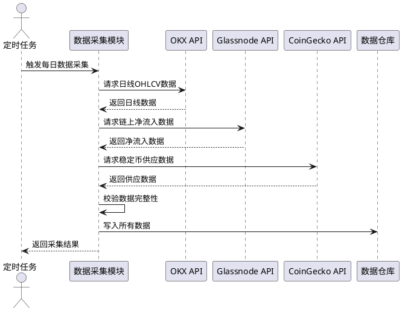
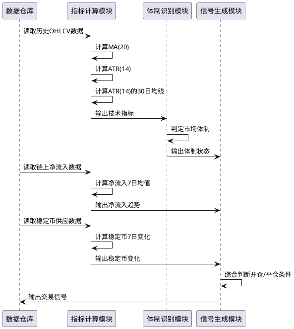
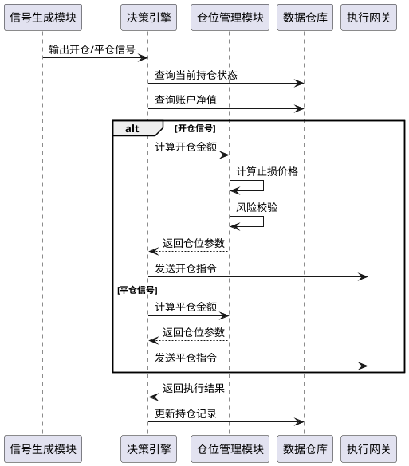
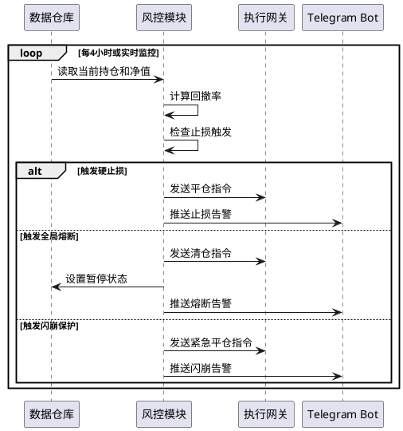
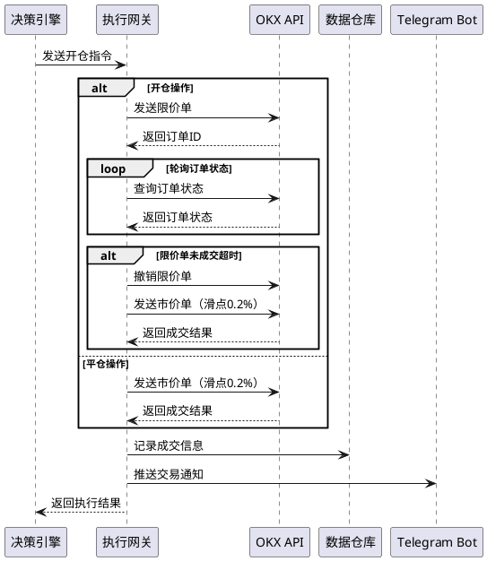
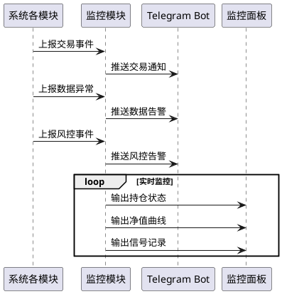
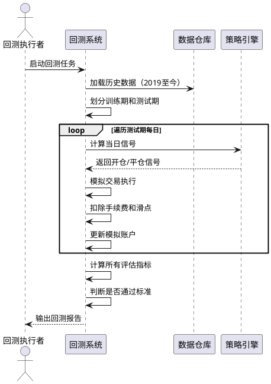

# AOSFT-MVP 需求规格说明书

**版本**: v1.0  
**项目名称**: AOSFT-MVP — 链上与体制感知的BTC趋势跟踪系统  
**生成日期**: 2026-05-18

---

# 1. 组件定位

## 1.1 核心职责

本组件负责自动化执行BTC趋势跟踪交易策略，通过识别市场体制和链上资金信号，在上升趋势启动时入场、趋势结束时离场，在震荡和下跌环境中保持空仓或轻仓，实现稳定的超额收益。

## 1.2 核心输入

1. **日线行情数据**: 来自OKX API的BTC/USDT每日OHLCV数据（开盘价、最高价、最低价、收盘价、交易量）
2. **链上净流入数据**: 来自Glassnode/CryptoQuant的交易所BTC净流入量数据
3. **稳定币供应数据**: 来自CoinGecko的USDT+USDC总供应量数据
4. **情绪指数数据**: 来自alternative.me API的Crypto Fear & Greed Index
5. **交易执行结果**: 来自交易所API的订单状态和成交信息
6. **定时触发信号**: 来自cron定时任务的每日运行触发信号

## 1.3 核心输出

1. **交易指令**: 发送给交易所API的开仓、平仓订单请求
2. **交易通知**: 通过Telegram Bot推送的开仓/平仓事件通知
3. **告警消息**: 通过Telegram Bot推送的数据异常、风控熔断告警
4. **监控数据**: 输出到监控面板的持仓信息、净值曲线、信号记录
5. **回测报告**: 生成的历史表现评估报告

## 1.4 职责边界

本组件明确不负责：

1. **其他币种交易**: 仅处理BTC/USDT，不支持其他数字货币
2. **高频交易**: 系统按日线级别运行，不进行分钟级或秒级交易
3. **杠杆交易**: 不支持高杠杆操作，仅允许现货或1x永续合约
4. **主观决策干预**: 系统运行期间不响应人工交易指令（仅可在熔断暂停期人工干预恢复）
5. **资金划转**: 不负责在交易所账户和银行账户之间进行资金划转操作
6. **市场预测分析**: 不提供市场走势预测报告，仅执行趋势跟踪策略

---

# 2. 领域术语

**市场体制 (Market Regime)**
: 根据价格趋势方向和波动性划分的市场状态，包含三种类型：BULL_VOLATILE（高波动上涨）、BEAR_VOLATILE（高波动下跌）、LOW_VOLATILE（低波动震荡）。

**链上净流入 (On-chain Netflow)**
: 交易所BTC地址的净流入量，计算公式为流入量减去流出量。负值表示BTC流出交易所（囤积信号），正值表示流入交易所（抛售信号）。

**ATR (Average True Range)**
: 平均真实波动幅度，用于衡量市场波动性的技术指标，计算周期为14日。

**趋势均线 (Trend MA)**
: 用于判断趋势方向的移动平均线，计算周期为20日。

**硬止损 (Hard Stop Loss)**
: 基于ATR动态计算的止损价格，止损距离为入场价减去2倍ATR(14)。

**熔断机制 (Circuit Breaker)**
: 当账户回撤或市场波动达到预设阈值时，强制平仓并暂停交易的紧急风控措施。

**滑点容忍 (Slippage Tolerance)**
: 市价单执行时允许的最大价格偏离比例，默认为0.2%。

**资金费率 (Funding Rate)**
: 永续合约多空双方之间的资金费率，用于判断市场情绪和持仓成本。

---

# 3. 角色与边界

## 3.1 核心角色

**交易系统管理员**
: 负责系统部署、参数配置、监控检查和异常处理的人工运维角色。

**投资决策者**
: 查看系统运行报告和交易记录，决定是否调整策略参数或暂停系统运行。

## 3.2 外部系统

**OKX API**
: 提供BTC/USDT行情数据查询和交易执行接口的交易所系统。

**Glassnode API / CryptoQuant API**
: 提供交易所BTC净流入链上数据的数据服务商。

**CoinGecko API**
: 提供稳定币市值和供应量数据的数据聚合平台。

**alternative.me API**
: 提供Crypto Fear & Greed Index情绪指数的服务。

**Telegram Bot API**
: 用于推送交易通知和告警消息的即时通讯平台。

**监控面板系统**
: Grafana或Web应用，用于可视化展示系统运行状态。

## 3.3 交互上下文

```plantuml
@startuml
skinparam componentStyle rectangle

rectangle "AOSFT-MVP系统" {
}

actor "交易系统管理员" as admin
actor "投资决策者" as investor

admin --> AOSFT-MVP系统 : 配置参数/启动停止/异常处理
investor --> AOSFT-MVP系统 : 查看报告/决策审批

rectangle "OKX API" as okx
rectangle "Glassnode/CryptoQuant" as glassnode
rectangle "CoinGecko API" as coingecko
rectangle "alternative.me API" as altme
rectangle "Telegram Bot" as telegram
rectangle "监控面板" as monitor

AOSFT-MVP系统 --> okx : 行情查询/交易执行
AOSFT-MVP系统 --> glassnode : 链上数据查询
AOSFT-MVP系统 --> coingecko : 稳定币数据查询
AOSFT-MVP系统 --> altme : 情绪指数查询
AOSFT-MVP系统 --> telegram : 推送通知/告警
AOSFT-MVP系统 --> monitor : 输出监控数据

@enduml
```

---

# 4. DFX约束

## 4.1 性能

1. **数据采集性能**: When 执行每日数据采集任务时，the AOSFT-MVP系统 shall 在5分钟内完成所有数据源的拉取和存储。
   - 验收条件: [触发每日定时任务] → [5分钟内完成数据采集并写入数据库]

2. **信号计算性能**: When 计算交易信号时，the AOSFT-MVP系统 shall 在30秒内完成所有指标计算和信号生成。
   - 验收条件: [触发信号计算流程] → [30秒内输出开仓/平仓信号]

3. **订单执行性能**: When 发送交易订单时，the AOSFT-MVP系统 shall 在10秒内完成订单提交并获得交易所确认。
   - 验收条件: [发送开仓或平仓指令] → [10秒内收到订单确认]

4. **资源占用限制**: While 系统正常运行时，the AOSFT-MVP系统 shall 单进程内存占用不超过2GB，CPU使用率不超过50%。
   - 验收条件: [系统持续运行24小时] → [内存≤2GB且CPU≤50%]

## 4.2 可靠性

1. **系统可用性**: While 系统处于正常运行状态时，the AOSFT-MVP系统 shall 保证99%的每日定时任务执行成功率。
   - 验收条件: [连续运行30天] → [至少29天成功执行定时任务]

2. **故障恢复能力**: If 系统因异常崩溃，the AOSFT-MVP系统 shall 在重新启动后自动恢复上次运行状态并继续运行。
   - 验收条件: [系统异常终止] → [重启后自动恢复持仓和运行状态]

3. **数据完整性**: While 数据采集过程中，the AOSFT-MVP系统 shall 保证每日数据不丢失、不重复、不损坏。
   - 验收条件: [执行数据采集] → [每日数据完整写入且可验证]

4. **熔断恢复时间**: If 触发全局回撤熔断，the AOSFT-MVP系统 shall 在30天后自动解除暂停状态。
   - 验收条件: [账户回撤≥20%触发熔断] → [30天后自动恢复可交易状态]

## 4.3 安全性

1. **API密钥保护**: While 系统运行期间，the AOSFT-MVP系统 shall 禁止在日志文件、错误消息、监控输出中明文显示交易所API密钥。
   - 验收条件: [系统输出任何信息] → [API密钥已脱敏或加密]

2. **交易权限限制**: While 向交易所发送交易指令时，the AOSFT-MVP系统 shall 仅使用配置的交易账户，禁止使用其他账户。
   - 验收条件: [发送交易订单] → [仅使用配置账户执行]

3. **参数变更审计**: When 修改系统配置参数时，the AOSFT-MVP系统 shall 记录变更操作人、变更时间、变更前后值到审计日志。
   - 验收条件: [执行参数修改操作] → [审计日志记录完整变更信息]

4. **告警消息安全**: While 推送Telegram告警消息时，the AOSFT-MVP系统 shall 不包含账户余额、持仓大小等敏感财务数据。
   - 验收条件: [发送Telegram通知] → [消息中不包含敏感财务数据]

## 4.4 可维护性

1. **日志记录完整性**: While 系统运行期间，the AOSFT-MVP系统 shall 记录所有交易决策、数据采集、风控事件的详细日志。
   - 验收条件: [系统运行24小时] → [所有关键操作均有日志记录]

2. **日志轮转机制**: While 系统长期运行时，the AOSFT-MVP系统 shall 自动保留最近90天的日志文件并删除更早的日志。
   - 验收条件: [系统运行超过90天] → [仅保留最近90天日志文件]

3. **监控指标输出**: While 系统运行期间，the AOSFT-MVP系统 shall 输出持仓状态、净值曲线、信号记录、风控指标等监控数据。
   - 验收条件: [系统运行] → [监控面板可实时查看系统状态]

4. **配置参数可调性**: Where 需要调整策略参数时，the AOSFT-MVP系统 shall 支持通过配置文件修改所有参数而无需修改代码。
   - 验收条件: [修改配置文件中的参数值] → [系统使用新参数运行]

## 4.5 兼容性

1. **数据源降级处理**: If 链上数据源API不可用，the AOSFT-MVP系统 shall 使用前一有效值并记录告警，不中断交易流程。
   - 验收条件: [Glassnode API返回错误] → [使用前一日数据并记录告警]

2. **交易所API兼容**: While 执行交易操作时，the AOSFT-MVP系统 shall 兼容OKX现货API和永续合约API的调用方式。
   - 验收条件: [配置交易模式为现货或合约] → [正确调用对应API]

3. **数据格式兼容**: While 读取历史数据时，the AOSFT-MVP系统 shall 支持CSV和SQLite两种存储格式的读写操作。
   - 验收条件: [配置存储格式为CSV或SQLite] → [正确读写对应格式数据]

---

# 5. 核心能力

## 5.1 数据采集

### 5.1.1 业务规则

1. **日线行情数据采集规则**
   - When 每日定时任务触发时，the 数据采集模块 shall 向OKX API请求BTC/USDT前一日OHLCV数据。
   - 验收条件: [每日定时任务触发] → [成功获取并存储前一日日线数据]
   
   - If 日线数据为空或价格≤0或交易量≤0，the 数据采集模块 shall 记录数据异常告警并使用前一日数据。
   - 验收条件: [OKX返回异常数据] → [记录告警并使用前一日数据]

2. **链上净流入数据采集规则**
   - When 每日定时任务触发时，the 数据采集模块 shall 向Glassnode或CryptoQuant API请求交易所BTC净流入数据。
   - 验收条件: [每日定时任务触发] → [成功获取链上净流入数据]
   
   - While 存储链上数据时，the 数据采集模块 shall 对数据应用shift(2)延迟处理，确保不使用未来信息。
   - 验收条件: [存储链上数据] → [数据时间戳延迟2天]

3. **稳定币供应数据采集规则**
   - When 每日定时任务触发时，the 数据采集模块 shall 向CoinGecko API查询USDT和USDC总供应量。
   - 验收条件: [每日定时任务触发] → [成功获取稳定币供应数据]
   
   - When 计算稳定币供应变化时，the 数据采集模块 shall 计算7日滚动变化率。
   - 验收条件: [获取稳定币供应数据] → [计算7日变化率并存储]

4. **情绪指数数据采集规则**
   - When 每日定时任务触发时，the 数据采集模块 shall 向alternative.me API请求Crypto Fear & Greed Index。
   - 验收条件: [每日定时任务触发] → [成功获取情绪指数数据]

5. **数据完整性校验规则**
   - When 完成所有数据源采集后，the 数据采集模块 shall 校验所有数据项非空且符合数值范围。
   - 验收条件: [数据采集完成] → [校验通过或记录异常]
   
   - While 每月执行数据核对时，the 数据采集模块 shall 对最近30天数据进行全量核对，防止累积误差。
   - 验收条件: [触发月度核对任务] → [输出数据一致性报告]

6. **数据时间戳管理规则**
   - When 存储任何数据时，the 数据采集模块 shall 为每个数据点标记实际采集时间和数据日期。
   - 验收条件: [存储数据] → [记录采集时间戳和数据日期]
   
   - While 读取数据时，the 数据采集模块 shall 检查数据新鲜度，计算距当前时间的延迟天数。
   - 验收条件: [读取数据] → [计算数据延迟天数]

7. **数据质量评分规则**
   - When 数据延迟天数≤1天时，the 数据采集模块 shall 标记数据质量评分为1.0（满分）。
   - 验收条件: [数据延迟≤1天] → [质量评分=1.0]
   
   - When 数据延迟天数=2天时，the 数据采集模块 shall 标记数据质量评分为0.8。
   - 验收条件: [数据延迟=2天] → [质量评分=0.8]
   
   - When 数据延迟天数≥3天时，the 数据采集模块 shall 标记数据质量评分为0.5并记录告警。
   - 验收条件: [数据延迟≥3天] → [质量评分=0.5且告警]

### 5.1.2 交互流程



### 5.1.3 异常场景

1. **数据源API超时**
   - 触发条件: [OKX或Glassnode API响应时间超过30秒]
   - 系统行为: [终止当前请求，使用前一交易日数据，记录告警日志]
   - 用户感知: [Telegram推送"数据源API超时，使用备用数据"告警]

2. **数据源返回异常格式**
   - 触发条件: [API返回的数据字段缺失或格式错误]
   - 系统行为: [解析失败，记录原始响应内容，使用前一日数据]
   - 用户感知: [Telegram推送"数据格式异常"告警]

3. **数据校验失败**
   - 触发条件: [价格≤0或交易量≤0或数据为空]
   - 系统行为: [拒绝写入异常数据，使用前一日数据，记录告警]
   - 用户感知: [Telegram推送"数据校验失败"告警]

4. **数据写入失败**
   - 触发条件: [数据库写入失败或磁盘空间不足]
   - 系统行为: [重试写入3次，若仍失败则终止任务并告警]
   - 用户感知: [Telegram推送"数据写入失败，请检查系统"紧急告警]

## 5.2 信号计算

### 5.2.1 业务规则

1. **技术指标计算规则**
   - When 计算趋势均线时，the 指标计算模块 shall 计算收盘价的20日简单移动平均线MA(20)。
   - 验收条件: [输入最近20日收盘价] → [输出MA(20)值]
   
   - When 计算ATR时，the 指标计算模块 shall 计算真实波动幅度的14日移动平均值ATR(14)。
   - 验收条件: [输入最近14日OHLC数据] → [输出ATR(14)值]
   
   - When 计算ATR均线时，the 指标计算模块 shall 计算ATR(14)的30日移动平均值。
   - 验收条件: [输入最近30日ATR值] → [输出ATR(14)的30日均线]

2. **市场体制定义规则**
   - When 收盘价>MA(20)且ATR(14)>ATR的30日均线时，the 体制识别模块 shall 判定市场体制为BULL_VOLATILE。
   - 验收条件: [满足高波动上涨条件] → [体制输出BULL_VOLATILE]
   
   - When 收盘价≤MA(20)且ATR(14)>ATR的30日均线时，the 体制识别模块 shall 判定市场体制为BEAR_VOLATILE。
   - 验收条件: [满足高波动下跌条件] → [体制输出BEAR_VOLATILE]
   
   - When ATR(14)≤ATR的30日均线时，the 体制识别模块 shall 判定市场体制为LOW_VOLATILE。
   - 验收条件: [满足低波动震荡条件] → [体制输出LOW_VOLATILE]

3. **链上信号计算规则**
   - When 计算净流入趋势时，the 指标计算模块 shall 计算交易所BTC净流入量的7日简单移动平均值。
   - 验收条件: [输入最近7日净流入数据] → [输出7日均值]
   
   - When 计算稳定币变化时，the 指标计算模块 shall 计算稳定币供应量的7日变化量。
   - 验收条件: [输入最近7日稳定币供应数据] → [输出7日变化量]

4. **开仓信号生成规则**
   - While 当前体制为BULL_VOLATILE，且净流入7日均值<0，且稳定币7日变化>0，且情绪指数<80时，the 信号生成模块 shall 生成开仓信号。
   - 验收条件: [满足所有开仓条件] → [输出开仓信号]
   
   - If 任一开仓条件不满足，the 信号生成模块 shall 不生成开仓信号。
   - 验收条件: [至少一个条件不满足] → [无开仓信号输出]

5. **平仓信号生成规则**
   - If 当前体制转为BEAR_VOLATILE，the 信号生成模块 shall 生成平仓信号。
   - 验收条件: [体制变为BEAR_VOLATILE] → [输出平仓信号]
   
   - If 净流入7日均值连续3日>0，the 信号生成模块 shall 生成平仓信号。
   - 验收条件: [净流入均值连续3日为正] → [输出平仓信号]
   
   - If 稳定币7日变化连续3日<0，the 信号生成模块 shall 生成平仓信号。
   - 验收条件: [稳定币变化连续3日为负] → [输出平仓信号]
   
   - If 当前价格≤入场价-2×ATR(14)，the 信号生成模块 shall 生成硬止损平仓信号。
   - 验收条件: [价格跌破止损价] → [输出硬止损平仓信号]

### 5.2.2 交互流程



### 5.2.3 异常场景

1. **历史数据不足**
   - 触发条件: [数据库中历史数据少于30天]
   - 系统行为: [无法计算ATR均线，暂停信号生成，记录告警]
   - 用户感知: [Telegram推送"历史数据不足，暂停交易"告警]

2. **指标计算异常**
   - 触发条件: [输入数据包含NaN或无穷大值]
   - 系统行为: [终止计算，记录异常日志，不生成信号]
   - 用户感知: [Telegram推送"指标计算异常"告警]

3. **链上数据缺失**
   - 触发条件: [最近7日链上净流入数据有空值]
   - 系统行为: [使用可用数据计算，若不足3日则不生成信号]
   - 用户感知: [Telegram推送"链上数据部分缺失"提示]

## 5.3 策略决策

### 5.3.1 业务规则

1. **仓位计算规则**
   - When 生成开仓信号时，the 仓位管理模块 shall 计算开仓金额为账户总净值的50%。
   - 验收条件: [触发开仓信号] → [仓位金额=账户净值×50%]
   
   - If 2×ATR(14)对应亏损超过账户总资产的5%，the 仓位管理模块 shall 减小仓位使止损亏损=账户总资产的5%。
   - 验收条件: [止损风险超过5%阈值] → [调整仓位使风险=5%]

2. **止损价格计算规则**
   - When 开仓成功后，the 仓位管理模块 shall 计算初始止损价为入场价-2×ATR(14)。
   - 验收条件: [开仓成交] → [止损价=入场价-2×ATR(14)]
   
   - While 持仓期间，the 仓位管理模块 shall 每4小时更新止损价，止损价只升不降。
   - 验收条件: [持仓超过4小时] → [更新止损价且不低于前值]

3. **交易频率限制规则**
   - While 当前持仓为多头时，the 决策引擎 shall 禁止生成新的开仓信号。
   - 验收条件: [已持有BTC多头] → [不生成新开仓信号]
   
   - When 平仓后，the 决策引擎 shall 在至少1个交易日后才允许再次开仓。
   - 验收条件: [平仓完成] → [至少1日后才能开仓]

4. **合约模式特殊规则**
   - Where 交易模式设置为永续合约时，the 决策引擎 shall 检查资金费率。
   - 验收条件: [配置为永续合约模式] → [检查资金费率]
   
   - If 资金费率<-0.1%，the 决策引擎 shall 暂停开仓操作。
   - 验收条件: [资金费率<-0.1%] → [暂不开仓]

5. **禁止项规则**
   - The 决策引擎 shall 禁止生成加仓信号，所有仓位一次性开足。
   - 验收条件: [任何时刻] → [不存在加仓信号]
   
   - The 决策引擎 shall 禁止使用杠杆交易，杠杆倍数固定为1x。
   - 验收条件: [交易执行] → [杠杆倍数=1x或现货模式]

### 5.3.2 交互流程



### 5.3.3 异常场景

1. **账户余额不足**
   - 触发条件: [计算的开仓金额>账户可用余额]
   - 系统行为: [调整开仓金额为可用余额的95%，记录告警]
   - 用户感知: [Telegram推送"余额不足，已调整仓位"告警]

2. **持仓状态异常**
   - 触发条件: [数据库记录显示持仓但交易所查询无持仓]
   - 系统行为: [同步持仓状态为空仓，记录严重告警]
   - 用户感知: [Telegram推送"持仓状态不一致，已同步"告警]

3. **止损价计算异常**
   - 触发条件: [ATR值为0或负数]
   - 系统行为: [使用默认止损比例5%计算止损价]
   - 用户感知: [Telegram推送"ATR异常，使用默认止损"提示]

## 5.4 风险控制

### 5.4.1 业务规则

1. **风控前置拦截规则**
   - When 信号生成模块产生任何交易信号时，the 风控前置拦截器 shall 在信号传递到执行层前进行拦截检查。
   - 验收条件: [信号生成] → [风控拦截器检查]
   
   - While 执行风控拦截检查时，the 风控拦截器 shall 检查熔断状态、数据新鲜度、市场异常波动等前置条件。
   - 验收条件: [拦截检查] → [检查熔断状态/数据新鲜度/市场异常]
   
   - If 任一风控检查未通过，the 风控拦截器 shall 行使一票否决权，阻止信号传递并记录否决原因。
   - 验收条件: [风控检查未通过] → [阻止信号执行并记录原因]

2. **硬止损执行规则**
   - While 持仓期间，the 风控模块 shall 每4小时检查一次价格是否跌破止损价。
   - 验收条件: [持仓状态] → [每4小时检查止损触发]
   
   - If 当前价格<止损价，the 风控模块 shall 立即触发市价全平。
   - 验收条件: [价格跌破止损价] → [立即市价平仓]

3. **闪崩保护规则**
   - If BTC价格在15分钟内下跌超过5%，the 风控模块 shall 立即市价全平，不等待日线确认。
   - 验收条件: [15分钟跌幅≥5%] → [立即平仓]

4. **全局回撤熔断规则**
   - While 账户净值从历史最高点回撤≥20%时，the 风控模块 shall 强制清仓并进入分级恢复期。
   - 验收条件: [回撤≥20%] → [清仓并进入分级恢复期]
   
   - While 熔断后第10天，the 风控模块 shall 允许恢复至50%仓位。
   - 验收条件: [熔断后第10天] → [允许50%仓位]
   
   - While 熔断后第20天，the 风控模块 shall 允许恢复至100%仓位。
   - 验收条件: [熔断后第20天] → [允许100%仓位]
   
   - While 处于熔断暂停期间，the 风控模块 shall 继续执行数据采集任务，保持系统观测状态。
   - 验收条件: [熔断暂停状态] → [继续数据采集]
   
   - If 管理员触发人工提前恢复，the 风控模块 shall 要求管理员确认后提前解除熔断状态。
   - 验收条件: [管理员确认提前恢复] → [解除熔断状态]

5. **黑天鹅熔断规则**
   - If 主流交易所（OKX、Coinbase）BTC价格在5分钟内跌幅≥3%且其他交易所跟随，the 风控模块 shall 平掉50%仓位。
   - 验收条件: [5分钟跌幅≥3%且市场联动] → [平仓50%]
   
   - If 24小时内BTC累计跌幅≥15%，the 风控模块 shall 全部清仓并禁止开仓7天。
   - 验收条件: [24小时跌幅≥15%] → [清仓并禁止开仓7天]

6. **异常波动熔断规则**
   - If BTC当日波动（最高价-最低价）超过10%且持仓浮亏>8%，the 风控模块 shall 强制平仓。
   - 验收条件: [波动>10%且浮亏>8%] → [强制平仓]

7. **风控优先级规则**
   - While 风控模块与信号引擎同时发出指令时，the 风控模块 shall 拥有一票否决权。
   - 验收条件: [风控与信号冲突] → [执行风控指令]

8. **数据新鲜度风控规则**
   - When 执行交易决策前，the 风控模块 shall 检查所有依赖数据的新鲜度。
   - 验收条件: [交易决策前] → [检查数据新鲜度]
   
   - If 任一关键数据延迟≥3天，the 风控模块 shall 暂停交易并推送告警。
   - 验收条件: [数据延迟≥3天] → [暂停交易并告警]

### 5.4.2 交互流程



### 5.4.3 异常场景

1. **风控计算数据缺失**
   - 触发条件: [无法获取当前价格或账户净值]
   - 系统行为: [暂停风控检查，记录严重告警，人工介入]
   - 用户感知: [Telegram推送"风控数据缺失，需人工检查"紧急告警]

2. **平仓执行失败**
   - 触发条件: [风控触发平仓但交易所返回失败]
   - 系统行为: [重试3次，每次间隔5秒，若仍失败则升级告警]
   - 用户感知: [Telegram推送"风控平仓失败，紧急处理"告警]

3. **熔断恢复失败**
   - 触发条件: [熔断暂停30天后尝试恢复但系统异常]
   - 系统行为: [保持暂停状态，记录异常，等待人工干预]
   - 用户感知: [Telegram推送"熔断恢复失败，需人工干预"告警]

## 5.5 交易执行

### 5.5.1 业务规则

1. **订单状态机管理规则**
   - When 订单创建时，the 订单状态机 shall 初始化订单状态为PENDING。
   - 验收条件: [订单创建] → [状态=PENDING]
   
   - When 订单部分成交时，the 订单状态机 shall 将状态转换为PARTIAL_FILLED。
   - 验收条件: [部分成交] → [状态=PARTIAL_FILLED]
   
   - When 订单全部成交时，the 订单状态机 shall 将状态转换为FILLED。
   - 验收条件: [全部成交] → [状态=FILLED]
   
   - When 订单被交易所拒绝时，the 订单状态机 shall 将状态转换为REJECTED。
   - 验收条件: [交易所拒绝] → [状态=REJECTED]
   
   - When 订单被撤销时，the 订单状态机 shall 将状态转换为CANCELLED。
   - 验收条件: [订单撤销] → [状态=CANCELLED]

2. **挂单超时管理规则**
   - When 限价单提交后，the 挂单超时管理器 shall 启动超时计时器。
   - 验收条件: [限价单提交] → [启动超时计时]
   
   - If 限价单在5分钟内未成交，the 挂单超时管理器 shall 撤销订单并改用市价单。
   - 验收条件: [限价单超时] → [撤单并改市价单]
   
   - If 限价单在30分钟内仍未完全成交，the 挂单超时管理器 shall 强制撤销并记录异常。
   - 验收条件: [限价单30分钟未成交] → [强制撤单并记录异常]

3. **开仓执行规则**
   - When 执行开仓操作时，the 执行网关 shall 先发送限价单，价格设置为买一价。
   - 验收条件: [触发开仓] → [发送限价单到买一价]
   
   - If 限价单在5分钟内未成交，the 执行网关 shall 撤单并改用市价单。
   - 验收条件: [限价单5分钟未成交] → [撤单并发送市价单]
   
   - While 发送市价单时，the 执行网关 shall 设置0.2%的滑点容忍。
   - 验收条件: [发送市价单] → [滑点容忍=0.2%]

4. **平仓执行规则**
   - When 执行平仓操作时，the 执行网关 shall 始终使用市价单。
   - 验收条件: [触发平仓] → [发送市价单]
   
   - While 发送平仓市价单时，the 执行网关 shall 设置0.2%的滑点容忍。
   - 验收条件: [发送平仓市价单] → [滑点容忍=0.2%]

5. **订单状态确认规则**
   - When 订单提交后，the 执行网关 shall 轮询交易所API查询订单状态，直到订单达到最终状态。
   - 验收条件: [订单已提交] → [轮询直到最终状态]
   
   - If 订单在60秒内未达到最终状态，the 执行网关 shall 记录超时告警并继续查询。
   - 验收条件: [订单60秒未完成] → [记录超时并继续查询]

6. **订单异常恢复规则**
   - When 检测到订单处于异常状态时，the 订单异常恢复器 shall 根据异常类型执行恢复策略。
   - 验收条件: [检测异常订单] → [执行恢复策略]
   
   - If 订单状态为PARTIAL_FILLED且超过30分钟无进展，the 订单异常恢复器 shall 撤销剩余订单。
   - 验收条件: [部分成交超时] → [撤销剩余订单]
   
   - If 订单状态为PENDING且超过60分钟无响应，the 订单异常恢复器 shall 主动查询交易所并同步状态。
   - 验收条件: [挂单超时无响应] → [主动同步状态]
   
   - If 订单状态为REJECTED，the 订单异常恢复器 shall 记录拒绝原因并通知管理员。
   - 验收条件: [订单被拒绝] → [记录原因并通知]

7. **交易结果记录规则**
   - When 订单成交后，the 执行网关 shall 记录成交价格、成交数量、手续费到数据库。
   - 验收条件: [订单成交] → [记录完整成交信息]
   
   - When 订单成交后，the 执行网关 shall 通过Telegram推送交易结果通知。
   - 验收条件: [订单成交] → [Telegram推送交易通知]

8. **禁止项规则**
   - The 执行网关 shall 禁止在非交易时间段发送订单（每日数据采集完成前）。
   - 验收条件: [数据采集未完成] → [拒绝发送订单]

### 5.5.2 交互流程



### 5.5.3 异常场景

1. **交易所API连接失败**
   - 触发条件: [无法连接OKX API]
   - 系统行为: [重试连接3次，每次间隔10秒，若仍失败则终止任务]
   - 用户感知: [Telegram推送"交易所连接失败"紧急告警]

2. **订单被交易所拒绝**
   - 触发条件: [交易所返回订单拒绝（余额不足、参数错误等）]
   - 系统行为: [记录错误详情，终止交易流程，等待人工处理]
   - 用户感知: [Telegram推送"订单被拒绝，需检查"告警]

3. **部分成交异常**
   - 触发条件: [订单部分成交后剩余未成交超过5分钟]
   - 系统行为: [撤销剩余订单，记录部分成交信息，触发告警]
   - 用户感知: [Telegram推送"订单部分成交，已撤单"告警]

4. **滑点过大**
   - 触发条件: [市价单成交价偏离预期价格超过0.5%]
   - 系统行为: [记录滑点异常，继续确认成交，发送告警]
   - 用户感知: [Telegram推送"滑点过大，成交价异常"告警]

## 5.6 监控告警

### 5.6.1 业务规则

1. **交易事件通知规则**
   - When 执行开仓或平仓操作成功后，the 监控模块 shall 通过Telegram Bot推送交易事件通知。
   - 验收条件: [交易执行成功] → [Telegram推送交易通知]
   
   - 通知内容应包含: [交易类型、交易价格、交易数量、持仓变化、盈亏情况]
   - 验收条件: [推送通知] → [包含完整交易信息]

2. **数据采集告警规则**
   - If 数据采集过程中任一数据源失败，the 监控模块 shall 通过Telegram Bot推送数据异常告警。
   - 验收条件: [数据源失败] → [Telegram推送告警]

3. **净值回撤告警规则**
   - If 账户净值单日回撤超过5%，the 监控模块 shall 通过Telegram Bot推送净值异常告警。
   - 验收条件: [单日回撤>5%] → [Telegram推送告警]

4. **风控熔断告警规则**
   - When 触发任何熔断机制时，the 监控模块 shall 通过Telegram Bot推送紧急告警。
   - 验收条件: [触发熔断] → [Telegram推送紧急告警]

5. **每日状态报告规则**
   - When 每日任务执行完成后，the 监控模块 shall 向监控面板输出当日状态报告。
   - 验收条件: [每日任务完成] → [输出状态报告]
   
   - 报告内容应包含: [当日信号、当前持仓、账户净值、累计收益、当前回撤]
   - 验收条件: [状态报告] → [包含完整运行状态]

6. **监控数据输出规则**
   - While 系统运行期间，the 监控模块 shall 持续输出持仓信息、净值曲线、信号记录到监控面板。
   - 验收条件: [系统运行] → [监控面板可实时查看数据]

7. **数据新鲜度监控规则**
   - While 系统运行期间，the 监控模块 shall 实时监控各数据源的最后更新时间。
   - 验收条件: [系统运行] → [监控各数据源最后更新时间]
   
   - If 任一数据源超过24小时未更新，the 监控模块 shall 推送数据新鲜度告警。
   - 验收条件: [数据源超24小时未更新] → [推送新鲜度告警]

8. **策略性能监控规则**
   - While 系统运行期间，the 监控模块 shall 统计交易信号胜率（盈利交易次数/总交易次数）。
   - 验收条件: [系统运行] → [统计信号胜率]
   
   - While 系统运行期间，the 监控模块 shall 计算平均盈亏比（平均盈利金额/平均亏损金额）。
   - 验收条件: [系统运行] → [计算盈亏比]
   
   - While 系统运行期间，the 监控模块 shall 统计最长连续亏损次数。
   - 验收条件: [系统运行] → [统计连续亏损次数]

9. **风控触发统计规则**
   - When 任何熔断机制触发时，the 监控模块 shall 记录熔断类型、触发时间、触发原因。
   - 验收条件: [熔断触发] → [记录熔断详情]
   
   - While 系统运行期间，the 监控模块 shall 统计各类熔断的累计触发次数。
   - 验收条件: [系统运行] → [统计各类熔断次数]

10. **API调用统计规则**
    - While 系统运行期间，the 监控模块 shall 统计各API调用成功率（成功次数/总调用次数）。
    - 验收条件: [系统运行] → [统计API成功率]
    
    - While 系统运行期间，the 监控模块 shall 记录API调用延迟分布（P50、P95、P99延迟）。
    - 验收条件: [系统运行] → [记录API延迟分布]

### 5.6.2 交互流程



### 5.6.3 异常场景

1. **Telegram推送失败**
   - 触发条件: [Telegram Bot API返回错误或超时]
   - 系统行为: [记录推送失败日志，继续系统运行，不影响交易]
   - 用户感知: [日志中记录推送失败，用户无法收到通知]

2. **监控面板连接失败**
   - 触发条件: [监控面板服务不可用]
   - 系统行为: [记录连接失败日志，继续输出数据到本地缓存]
   - 用户感知: [监控面板无法显示数据，但系统正常运行]

3. **告警频率过高**
   - 触发条件: [短时间内触发大量告警（如连续数据异常）]
   - 系统行为: [合并同类告警，限制推送频率为每5分钟一次]
   - 用户感知: [收到合并告警，减少通知骚扰]

## 5.7 回测验证

### 5.7.1 业务规则

1. **回测数据范围规则**
   - When 执行回测任务时，the 回测系统 shall 使用2019-01-01至最近完整月份的历史数据。
   - 验收条件: [触发回测] → [加载完整历史数据]
   
   - 回测数据划分: [2022-01-01之前为训练期，2022-01-01之后为测试期]
   - 验收条件: [回测执行] → [按日期划分训练和测试期]

2. **现实摩擦模拟规则**
   - While 执行回测时，the 回测系统 shall 模拟链上数据延迟2天。
   - 验收条件: [回测计算] → [链上数据延迟2天]
   
   - While 执行回测时，the 回测系统 shall 扣除手续费0.1%单边。
   - 验收条件: [回测交易] → [扣除0.1%手续费]
   
   - While 执行回测时，the 回测系统 shall 扣除滑点0.1%。
   - 验收条件: [回测交易] → [扣除0.1%滑点]
   
   - Where 使用永续合约模式回测时，the 回测系统 shall 扣除资金费率成本。
   - 验收条件: [合约回测] → [扣除资金费率成本]

3. **回测评估指标规则**
   - When 回测完成后，the 回测系统 shall 计算年化收益率、夏普比率、最大回撤、卡尔玛比率。
   - 验收条件: [回测完成] → [输出收益和风险指标]
   
   - When 回测完成后，the 回测系统 shall 计算胜率、盈亏比、最长连续亏损次数。
   - 验收条件: [回测完成] → [输出交易统计指标]
   
   - When 回测完成后，the 回测系统 shall 计算相对BTC现货的超额收益。
   - 验收条件: [回测完成] → [输出超额收益指标]

4. **回测通过标准规则**
   - If 测试期年化收益≥BTC现货的90%且最大回撤≤25%，the 回测系统 shall 判定回测通过。
   - 验收条件: [满足通过标准] → [输出"回测通过"]
   
   - If 未满足通过标准，the 回测系统 shall 输出"回测未通过"建议重新审视策略。
   - 验收条件: [不满足通过标准] → [输出"回测未通过"及改进建议]

5. **模拟盘验证规则**
   - When 回测通过后，the 回测系统 shall 在OKX Testnet环境执行模拟盘验证。
   - 验收条件: [回测通过] → [启动Testnet验证]
   
   - While 模拟盘运行期间，the 回测系统 shall 监控与真实交易环境的差异。
   - 验收条件: [模拟盘运行] → [监控环境差异]
   
   - If 模拟盘连续运行30天且表现符合预期，the 回测系统 shall 输出"模拟盘验证通过"。
   - 验收条件: [模拟盘30天符合预期] → [验证通过]

6. **极端行情回测规则**
   - When 执行极端行情回测时，the 回测系统 shall 测试黑天鹅场景表现（如2020年3月12日暴跌）。
   - 验收条件: [触发极端行情回测] → [测试黑天鹅场景]
   
   - While 极端行情回测时，the 回测系统 shall 验证风控机制是否有效触发。
   - 验收条件: [极端行情回测] → [验证风控触发]
   
   - If 极端行情下最大亏损超过账户50%，the 回测系统 shall 输出"风控不足"警告。
   - 验收条件: [极端亏损超50%] → [输出风控警告]

7. **参数敏感性分析规则**
   - When 执行参数敏感性分析时，the 回测系统 shall 对关键参数进行±20%变动测试。
   - 验收条件: [触发参数分析] → [参数变动测试]
   
   - While 参数敏感性分析时，the 回测系统 shall 计算策略表现对参数变化的敏感度。
   - 验收条件: [参数分析] → [计算敏感度]
   
   - If 参数变动导致策略表现剧烈波动（收益变化>100%），the 回测系统 shall 输出"参数敏感"警告。
   - 验收条件: [收益剧烈波动] → [输出参数敏感警告]

8. **并发压力测试规则**
   - When 执行并发压力测试时，the 回测系统 shall 模拟多个定时任务同时触发的场景。
   - 验收条件: [触发并发测试] → [模拟并发场景]
   
   - While 并发压力测试时，the 回测系统 shall 监控系统资源占用和任务执行时间。
   - 验收条件: [并发测试] → [监控资源和时间]
   
   - If 并发场景下任务执行失败率>1%，the 回测系统 shall 输出"并发处理不足"警告。
   - 验收条件: [并发失败率>1%] → [输出并发警告]

### 5.7.2 交互流程



### 5.7.3 异常场景

1. **历史数据缺失**
   - 触发条件: [回测时间段内部分日期数据缺失]
   - 系统行为: [使用前一日数据填充，记录数据缺失警告]
   - 用户感知: [回测报告中标注数据缺失日期]

2. **回测计算溢出**
   - 触发条件: [计算过程中数值溢出或异常]
   - 系统行为: [终止回测，记录异常日志，输出错误报告]
   - 用户感知: [回测失败，提示检查数据或参数]

3. **回测超时**
   - 触发条件: [回测运行时间超过1小时]
   - 系统行为: [终止回测，输出已完成部分的结果，记录超时告警]
   - 用户感知: [回测超时提示，建议缩短回测时间范围]

---

# 6. 数据约束

## 6.1 日线行情数据

1. **日期**: 必填，格式为YYYY-MM-DD，唯一标识一条日线数据，不可重复。
2. **开盘价**: 必填，正数，单位为USDT，精度保留2位小数。
3. **最高价**: 必填，正数，单位为USDT，精度保留2位小数，必须≥开盘价和收盘价。
4. **最低价**: 必填，正数，单位为USDT，精度保留2位小数，必须≤开盘价和收盘价。
5. **收盘价**: 必填，正数，单位为USDT，精度保留2位小数。
6. **交易量**: 必填，非负数，单位为BTC，精度保留8位小数。

## 6.2 链上净流入数据

1. **日期**: 必填，格式为YYYY-MM-DD，唯一标识一条净流入数据，不可重复。
2. **净流入量**: 必填，可为正或负，单位为BTC，精度保留8位小数，负值表示流出。
3. **数据来源**: 必填，枚举值为["Glassnode", "CryptoQuant"]。
4. **数据延迟标记**: 必填，标识该数据相对于实际发生时间的延迟天数，取值范围为非负整数。
5. **采集时间戳**: 必填，数据实际采集的时间，格式为Unix时间戳（毫秒）。
6. **数据新鲜度**: 必填，数据距当前时间的延迟天数，取值范围为非负整数。
7. **质量评分**: 必填，数据质量评分，取值范围0-1，延迟≤1天为1.0，延迟2天为0.8，延迟≥3天为0.5。

## 6.3 稳定币供应数据

1. **日期**: 必填，格式为YYYY-MM-DD，唯一标识一条供应数据，不可重复。
2. **USDT供应量**: 必填，正数，单位为USDT，精度保留2位小数。
3. **USDC供应量**: 必填，正数，单位为USDT，精度保留2位小数。
4. **总供应量**: 必填，等于USDT供应量加USDC供应量，单位为USDT，精度保留2位小数。
5. **7日变化量**: 必填，可为正或负，单位为USDT，精度保留2位小数。

## 6.4 情绪指数数据

1. **日期**: 必填，格式为YYYY-MM-DD，唯一标识一条情绪指数数据，不可重复。
2. **恐惧贪婪指数**: 必填，整数，取值范围0-100，0表示极度恐惧，100表示极度贪婪。
3. **分类标签**: 必填，枚举值为["Extreme Fear", "Fear", "Neutral", "Greed", "Extreme Greed"]。

## 6.5 交易信号记录

1. **信号ID**: 必填，全局唯一标识符，格式为UUID。
2. **信号时间**: 必填，时间戳格式，精确到秒。
3. **信号类型**: 必填，枚举值为["OPEN", "CLOSE", "STOP_LOSS", "FORCED_CLOSE"]。
4. **触发原因**: 必填，字符串，描述信号触发的详细原因。
5. **体制状态**: 必填，枚举值为["BULL_VOLATILE", "BEAR_VOLATILE", "LOW_VOLATILE"]。
6. **净流入趋势**: 必填，数字，触发时刻的净流入7日均值。
7. **稳定币变化**: 必填，数字，触发时刻的稳定币7日变化量。
8. **是否执行**: 必填，布尔值，标识信号是否被实际执行。

## 6.6 持仓记录

1. **持仓ID**: 必填，全局唯一标识符，格式为UUID。
2. **开仓时间**: 必填，时间戳格式，精确到秒。
3. **开仓价格**: 必填，正数，单位为USDT，精度保留2位小数。
4. **持仓数量**: 必填，正数，单位为BTC，精度保留8位小数。
5. **持仓金额**: 必填，正数，单位为USDT，精度保留2位小数，等于开仓价格乘以持仓数量。
6. **止损价格**: 必填，正数，单位为USDT，精度保留2位小数，必须<开仓价格。
7. **平仓时间**: 可选，时间戳格式，精确到秒，持仓结束后必填。
8. **平仓价格**: 可选，正数，单位为USDT，精度保留2位小数，持仓结束后必填。
9. **盈亏金额**: 可选，数字，单位为USDT，精度保留2位小数，持仓结束后必填。

## 6.7 订单记录

1. **订单ID**: 必填，全局唯一标识符，由交易所返回。
2. **客户端订单ID**: 必填，客户端生成的订单标识，格式为UUID。
3. **交易对**: 必填，交易对符号，如"BTC/USDT"。
4. **订单类型**: 必填，枚举值为["LIMIT", "MARKET"]。
5. **买卖方向**: 必填，枚举值为["BUY", "SELL"]。
6. **订单价格**: 限价单必填，市价单可选，单位为USDT，精度保留2位小数。
7. **订单数量**: 必填，正数，单位为BTC，精度保留8位小数。
8. **订单状态**: 必填，枚举值为["PENDING", "PARTIAL_FILLED", "FILLED", "REJECTED", "CANCELLED"]。
9. **已成交数量**: 必填，非负数，单位为BTC，精度保留8位小数。
10. **剩余数量**: 必填，非负数，等于订单数量减去已成交数量。
11. **平均成交价**: 可选，已成交部分的平均价格，单位为USDT。
12. **手续费**: 可选，已支付的手续费，单位为USDT。
13. **创建时间**: 必填，时间戳格式，精确到毫秒。
14. **更新时间**: 必填，时间戳格式，精确到毫秒。
15. **超时标记**: 必填，布尔值，标识订单是否触发超时处理。
16. **异常原因**: 可选，字符串，记录订单异常的具体原因。

## 6.8 账户净值记录

1. **日期**: 必填，格式为YYYY-MM-DD，唯一标识一条净值记录，不可重复。
2. **账户余额**: 必填，非负数，单位为USDT，精度保留2位小数。
3. **持仓市值**: 必填，非负数，单位为USDT，精度保留2位小数。
4. **总净值**: 必填，非负数，单位为USDT，精度保留2位小数，等于账户余额加持仓市值。
5. **日收益率**: 必填，数字，取值范围-100%至+∞，精度保留6位小数。
6. **累计收益率**: 必填，数字，取值范围-100%至+∞，精度保留6位小数。
7. **最大回撤**: 必填，非负数，取值范围0%-100%，精度保留6位小数。
8. **历史最高净值**: 必填，正数，单位为USDT，精度保留2位小数。

## 6.9 系统配置参数

1. **趋势均线周期**: 必填，正整数，默认值20，单位为日。
2. **ATR计算周期**: 必填，正整数，默认值14，单位为日。
3. **ATR均线周期**: 必填，正整数，默认值30，单位为日，用于判定波动率高低。
4. **净流入平滑天数**: 必填，正整数，默认值7，单位为日。
5. **稳定币变化统计天数**: 必填，正整数，默认值7，单位为日。
6. **连续信号确认天数**: 必填，正整数，默认值3，单位为日。
7. **止损ATR倍数**: 必填，正数，默认值2.0。
8. **仓位占比**: 必填，小数，取值范围0-1，默认值0.5，表示50%仓位。
9. **单笔最大亏损占比**: 必填，小数，取值范围0-1，默认值0.05，表示5%。
10. **全局最大回撤熔断阈值**: 必填，小数，取值范围0-1，默认值0.20，表示20%。
11. **情绪过热阈值**: 必填，整数，取值范围0-100，默认值80，高于此值不开仓。
12. **熔断暂停天数**: 必填，正整数，默认值30，单位为日。
13. **分级恢复第一阶段天数**: 必填，正整数，默认值10，熔断后第10天恢复50%仓位。
14. **分级恢复第二阶段天数**: 必填，正整数，默认值20，熔断后第20天恢复100%仓位。
15. **挂单超时时间**: 必填，正整数，默认值5，单位为分钟。
16. **订单最大超时时间**: 必填，正整数，默认值30，单位为分钟。
17. **数据新鲜度阈值**: 必填，正整数，默认值3，数据延迟超过3天触发告警。
18. **数据质量满分阈值**: 必填，正整数，默认值1，数据延迟≤1天评分为1.0。
19. **数据质量降权阈值**: 必填，正整数，默认值2，数据延迟=2天评分为0.8。

---

# 7. 附录

## 7.1 预期性能目标

- 牛市捕获率: 80%-110% BTC涨幅
- 熊市最大回撤: ≤25%
- 年化胜率: 45%-55%
- 盈亏比: >2.0
- 长期年化超额收益: 跑赢BTC现货持有收益20%以上

## 7.2 交易时间约束

- 数据采集时间: 每日UTC 00:05（OKX日线数据生成后5分钟）
- 信号计算时间: 每日UTC 00:10
- 交易执行窗口: 每日UTC 00:15-23:45（留出缓冲时间）

## 7.3 禁止事项清单

1. 禁止在数据采集完成前执行交易
2. 禁止使用高杠杆（杠杆倍数固定为1x或现货）
3. 禁止加仓操作（仓位一次性开足）
4. 禁止在熔断暂停期间自动交易
5. 禁止交易除BTC/USDT外的任何标的
6. 禁止修改历史交易记录
7. 禁止绕过风控模块执行交易

---

**文档结束**
